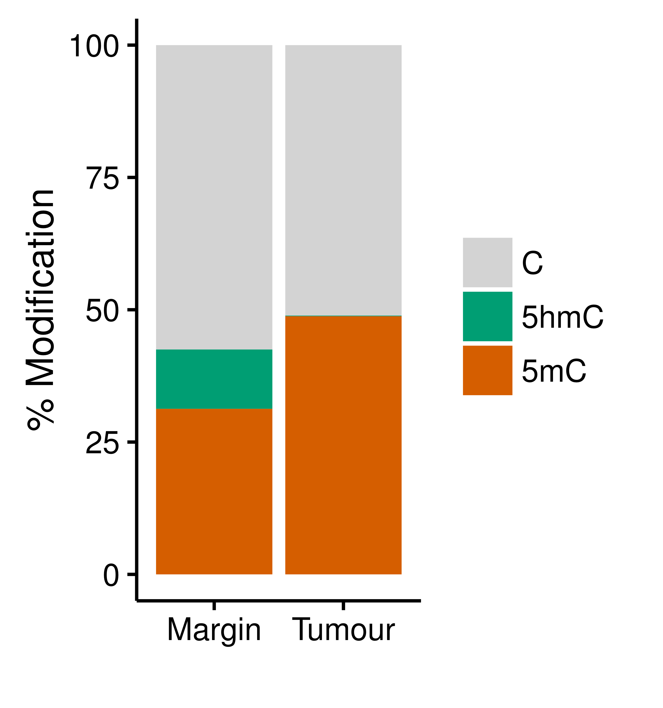
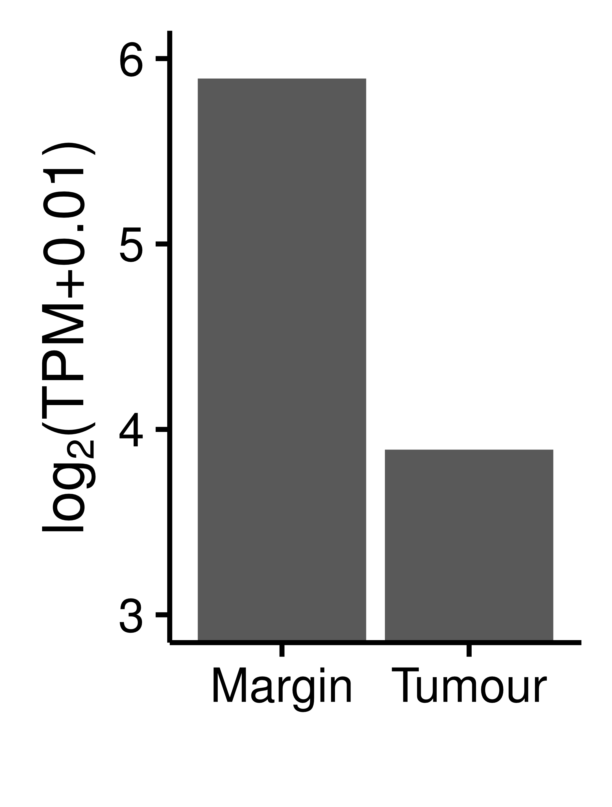
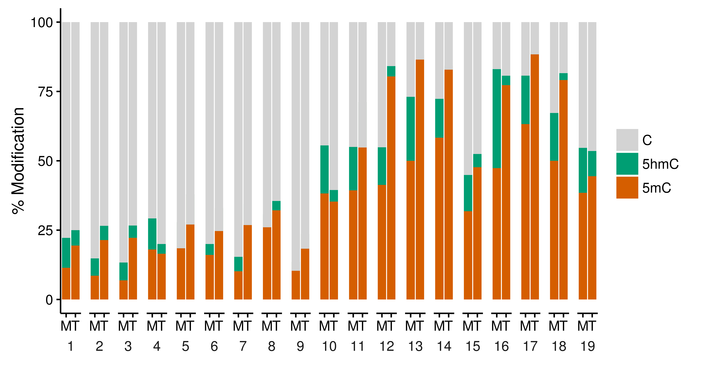
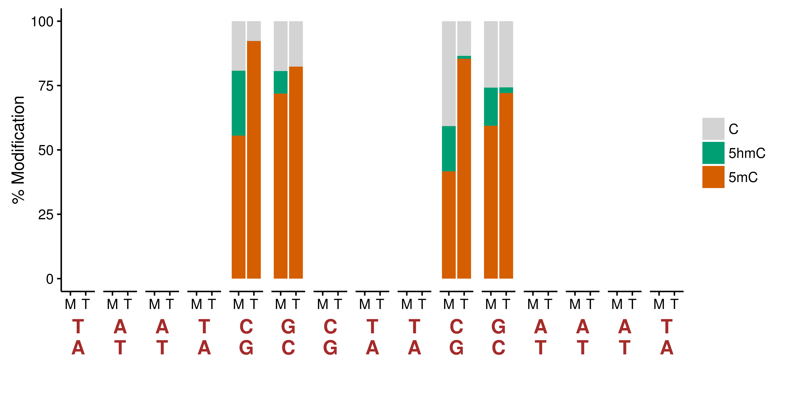
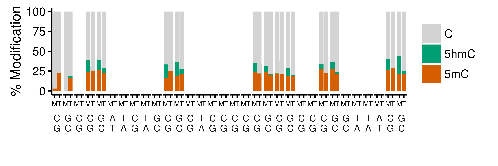

Show 5mC, 5hmC, genotype data in the promoter region of several genes of interest and the corresponding transcript level changes between tumour and margin

* ATRX
* FAT2
* MTOR
* MET
* NOTCH2


```R
library(data.table)
library(ggplot2)


# Loading methylation

ear042_M8BS <- fread("/lustre/sblab/martin03/repository/20150921_BrainMethylomeRoadMap/tsgenes_oncogenes/data/methylation_cpg_promoter/ear042_M8BS.cpg_genes.promoters.all.cancer.glioblastoma.1000.sorted.bed")
setnames(ear042_M8BS, c("chr", "start", "end", "cnt_met", "cnt_tot", "strand", "gene_name", "cancer", "glioblastoma"))

ear043_M8oxBS <- fread("/lustre/sblab/martin03/repository/20150921_BrainMethylomeRoadMap/tsgenes_oncogenes/data/methylation_cpg_promoter/ear043_M8oxBS.cpg_genes.promoters.all.cancer.glioblastoma.1000.sorted.bed")
setnames(ear043_M8oxBS, c("chr", "start", "end", "cnt_met", "cnt_tot", "strand", "gene_name", "cancer", "glioblastoma"))

ear044_T3BS <- fread("/lustre/sblab/martin03/repository/20150921_BrainMethylomeRoadMap/tsgenes_oncogenes/data/methylation_cpg_promoter/ear044_T3BS.cpg_genes.promoters.all.cancer.glioblastoma.1000.sorted.bed")
setnames(ear044_T3BS, c("chr", "start", "end", "cnt_met", "cnt_tot", "strand", "gene_name", "cancer", "glioblastoma"))

ear045_T3oxBS <- fread("/lustre/sblab/martin03/repository/20150921_BrainMethylomeRoadMap/tsgenes_oncogenes/data/methylation_cpg_promoter/ear045_T3oxBS.cpg_genes.promoters.all.cancer.glioblastoma.1000.sorted.bed")
setnames(ear045_T3oxBS, c("chr", "start", "end", "cnt_met", "cnt_tot", "strand", "gene_name", "cancer", "glioblastoma"))

setkey(ear042_M8BS, chr, start, end, strand, gene_name, cancer, glioblastoma)
setkey(ear043_M8oxBS, chr, start, end, strand, gene_name, cancer, glioblastoma)
setkey(ear044_T3BS, chr, start, end, strand, gene_name, cancer, glioblastoma)
setkey(ear045_T3oxBS, chr, start, end, strand, gene_name, cancer, glioblastoma)

M8 <- merge(ear042_M8BS, ear043_M8oxBS, suffixes = c(".BS", ".oxBS"))
T3 <- merge(ear044_T3BS, ear045_T3oxBS, suffixes = c(".BS", ".oxBS"))

setkey(M8, chr, start, end, strand, gene_name, cancer, glioblastoma)
setkey(T3, chr, start, end, strand, gene_name, cancer, glioblastoma)
M8.T3 <- merge(M8, T3, suffixes = c(".M8", ".T3"))

CancerLP2000729_DNA_E01_NormalLP2000729_DNA_C01.somatic <- fread("/lustre/sblab/martin03/repository/20150921_BrainMethylomeRoadMap/snv/CancerLP2000729-DNA_E01_NormalLP2000729-DNA_C01.somatic.bedGraph")
setnames(CancerLP2000729_DNA_E01_NormalLP2000729_DNA_C01.somatic, c("chr", "start", "end", "ref", "alt", "qss", "tqss"))


# Loading expression

tx<- fread('/lustre/sblab/martin03/repository/20150921_BrainMethylomeRoadMap/rnaseq/data/tx_quant_lfc.bed')

gxPlus<- tx[Strand == '+', list(
    chrom= min(chrom),
    promStart= min(promStart),
    Strand= min(Strand),
    ear047_F3= sum(ear047_F3),
    ear049_M3= sum(ear049_M3)), by= list(Associated_Gene_Name)]

gxMinus<- tx[Strand == '-', list(
    chrom= min(chrom),
    promStart= max(promStart),
    Strand= min(Strand),
    ear047_F3= sum(ear047_F3),
    ear049_M3= sum(ear049_M3)), by= list(Associated_Gene_Name)]

gx<- rbindlist(list(gxPlus, gxMinus))
gx[, promEnd := promStart + 1000]
gx[, tpmLog2FC := log2((ear047_F3 + 0.01) / (ear049_M3 + 0.01))]
gx$tpmLog2Avg<- rowMeans(gx[, list(log2(ear047_F3 + 0.01), log2(ear049_M3 + 0.01))])
gx<- gx[, list(chrom, promStart, promEnd, Associated_Gene_Name, Strand, ear047_F3, ear049_M3, tpmLog2FC, tpmLog2Avg)][order(chrom, promStart, promEnd)]


# ATRX
# X 76760356..77041755
# https://www.ncbi.nlm.nih.gov/gene?cmd=retrieve&dopt=default&rn=1&list_uids=546
# In reverse strand

M8.T3[gene_name == "ATRX"]
# from 77041721 to 77042702

# see /lustre/sblab/martin03/repository/20150921_BrainMethylomeRoadMap/tsgenes_oncogenes/figures/20160308_ATRX.promoter.pdf

data.frame(CancerLP2000729_DNA_E01_NormalLP2000729_DNA_C01.somatic[chr == "chrX"])
# chrX  76799744  76799745   T   A  48    1 (intron)
# chrX  77030992  77030993   C   A  79    1 (intron)

gx[Associated_Gene_Name == "ATRX"]
#   chrom promStart  promEnd Associated_Gene_Name Strand ear047_F3 ear049_M3
#1:  chrX  77041702 77042702                 ATRX      -  14.82295  59.38328
#   tpmLog2FC tpmLog2Avg
#1: -2.001495   4.891481


# FAT2
# https://www.ncbi.nlm.nih.gov/gene/2196
# 5 150883653..150948505
# In reverse strand

M8.T3[gene_name == "FAT2"]
# from 150948505 to 150949442

data.frame(CancerLP2000729_DNA_E01_NormalLP2000729_DNA_C01.somatic[chr == "chr5"])
# chr5 150907536 150907537   G   A  88    1 (intron)

gx[Associated_Gene_Name == "FAT2"]
#chrom promStart   promEnd Associated_Gene_Name Strand ear047_F3 ear049_M3
#1:  chr5 150948505 150949505                 FAT2      - 0.0640716  0.470815
#tpmLog2FC tpmLog2Avg
#1: -2.698489  -2.405691


# MTOR
# https://www.ncbi.nlm.nih.gov/gene/2475
# 1 11166588..11322614
# In reverse strand

M8.T3[gene_name == "MTOR"]
# from 11322608 to 11323536

data.frame(CancerLP2000729_DNA_E01_NormalLP2000729_DNA_C01.somatic[chr == "chr1"])
# chr1  11232417  11232418   T   G  23    1 (intron)

gx[Associated_Gene_Name == "MTOR"]
#   chrom promStart  promEnd Associated_Gene_Name Strand ear047_F3 ear049_M3
#1:  chr1  11322564 11323564                 MTOR      -  18.52868  49.70869
#   tpmLog2FC tpmLog2Avg
#1: -1.423249   4.924092


# MET
# https://www.ncbi.nlm.nih.gov/gene/4233
# 7 116312406..116438440
# forward strand

M8.T3[gene_name == "MET"]
# from 116311495 to 116312455

data.frame(CancerLP2000729_DNA_E01_NormalLP2000729_DNA_C01.somatic[chr == "chr7"])
# chr7 116320140 116320141   G   A  93    1 (intron)
# chr7 116346998 116346999   T   A  81    1 (intron)
# chr7 116385520 116385521   G   T  55    1 (intron)

gx[Associated_Gene_Name == "MET"]
#   chrom promStart   promEnd Associated_Gene_Name Strand ear047_F3 ear049_M3
#1:  chr7 116311443 116312443                  MET      +   70.1695  15.25675
#   tpmLog2FC tpmLog2Avg
#1:  2.200657   5.032649


# NOTCH2
# https://www.ncbi.nlm.nih.gov/gene/4853
# 1 120454176..120639880
# reverse strand

M8.T3[gene_name == "NOTCH2"]
# from 120612319 to 120613025

data.frame(CancerLP2000729_DNA_E01_NormalLP2000729_DNA_C01.somatic[chr == "chr1"])
# chr1 120482989 120482990   A   G 122    1 (intron)
# chr1 120603067 120603068   T   C  46    1 (intron)

gx[Associated_Gene_Name == "NOTCH2"]
#chrom promStart   promEnd Associated_Gene_Name Strand ear047_F3 ear049_M3
#1:  chr1 120612240 120613240               NOTCH2      -  284.3869  338.1358
# tpmLog2FC tpmLog2Avg
#1: -0.2497395   8.276632


```


Draw promoter CpG sites, summary plots and expression changes for ATRX:

```R

xdata<-M8.T3[gene_name == "ATRX"] # M8.T3 was created above
xdata[, cpg := rep(1:(nrow(xdata)/2), each=2)]

tab<-xdata[, list(pct_5mC.M8=100*sum(cnt_met.oxBS.M8)/sum(cnt_tot.oxBS.M8), pct_5hmC.M8=100*(sum(cnt_met.BS.M8)/sum(cnt_tot.BS.M8) - sum(cnt_met.oxBS.M8)/sum(cnt_tot.oxBS.M8)), pct_C_other.M8=100*(1-sum(cnt_met.BS.M8)/sum(cnt_tot.BS.M8)), pct_5mC.T3=100*sum(cnt_met.oxBS.T3)/sum(cnt_tot.oxBS.T3), pct_5hmC.T3=100*(sum(cnt_met.BS.T3)/sum(cnt_tot.BS.T3) - sum(cnt_met.oxBS.T3)/sum(cnt_tot.oxBS.T3)), pct_C_other.T3=100*(1-sum(cnt_met.BS.T3)/sum(cnt_tot.BS.T3))), by=gene_name]

tab.summary <- reshape2::melt(tab, id.vars = "gene_name", variable.name = "sample", value.name = "pct_met")
tab.summary[, sample2 := factor(c(rep("Margin",3),rep("Tumour",3)))]
tab.summary[, label := factor(rep(c("5mC", "5hmC", "C"),2), levels = c("C", "5hmC", "5mC"))]
tab.summary[, sample := NULL]

gg <- ggplot(tab.summary, aes(x = sample2, y = pct_met, fill = label)) +
geom_bar(stat = "identity") +
xlab("") +
ylab("% Modification") +
theme_classic() +
theme(legend.title = element_blank(), strip.background = element_blank(), strip.text = element_text(size=12)) +
scale_fill_manual(values=c("lightgray", "#009E73", "#D55E00"))
ggsave("/lustre/sblab/martin03/repository/20150921_BrainMethylomeRoadMap/examples/figures/20160829_ATRX.promoter.BS.oxBS.summary.pdf", width = 7.5/2.54, height = 8/2.54)


xdata2 <- gx[Associated_Gene_Name == "ATRX"]

tab2 <- xdata2[, list(Associated_Gene_Name = Associated_Gene_Name, ear047_F3.log = log2(ear047_F3 + 0.01), ear049_M3.log = log2(ear049_M3 + 0.01))]

tab.summary2 <- reshape2::melt(tab2, id.vars = "Associated_Gene_Name", variable.name = "sample", value.name = "expression")
tab.summary2[, sample2 := factor(c("Tumour", "Margin"))]
tab.summary2[, sample := NULL]

gg2 <- ggplot(tab.summary2, aes(x = sample2, y = expression)) +
geom_bar(stat = "identity") +
xlab("") +
ylab(expression("log"[2]*"(TPM+0.01)")) +
theme_classic() +
theme(legend.title = element_blank(), strip.background = element_blank(), strip.text = element_text(size=12)) +
coord_cartesian(ylim = c(3, 6)) +
scale_y_continuous(breaks = seq(0, 10, 1))
ggsave("/lustre/sblab/martin03/repository/20150921_BrainMethylomeRoadMap/examples/figures/20160829_ATRX.expression.ylim3_6.pdf", width = 4.55/2.54, height = 6/2.54)


tab3 <- xdata[, list(pct_5mC.M8=100*sum(cnt_met.oxBS.M8)/sum(cnt_tot.oxBS.M8), pct_5hmC.M8=100*(sum(cnt_met.BS.M8)/sum(cnt_tot.BS.M8) - sum(cnt_met.oxBS.M8)/sum(cnt_tot.oxBS.M8)), pct_C_other.M8=100*(1-sum(cnt_met.BS.M8)/sum(cnt_tot.BS.M8)), pct_5mC.T3=100*sum(cnt_met.oxBS.T3)/sum(cnt_tot.oxBS.T3), pct_5hmC.T3=100*(sum(cnt_met.BS.T3)/sum(cnt_tot.BS.T3) - sum(cnt_met.oxBS.T3)/sum(cnt_tot.oxBS.T3)), pct_C_other.T3=100*(1-sum(cnt_met.BS.T3)/sum(cnt_tot.BS.T3))), by=cpg]

tab.summary3 <- reshape2::melt(tab3, id.vars = "cpg", variable.name = "sample", value.name = "pct_met")
tab.summary3[, sample2 := factor(c(rep("M", 19*3), rep("T", 19*3)))]
tab.summary3[, label := factor(rep(c(rep("5mC", 19), rep("5hmC", 19), rep("C", 19)),2), levels = c("C", "5hmC", "5mC"))]
tab.summary3[, sample:=NULL]

gg3 <- ggplot(tab.summary3, aes(x = sample2, y = pct_met, fill = label)) +
geom_bar(stat = "identity") +
xlab("") +
ylab("% Modification") +
theme_classic() +
theme(legend.title = element_blank(), strip.background = element_blank()) +
scale_fill_manual(values=c("lightgray", "#009E73", "#D55E00")) +
facet_grid(. ~ cpg, switch = "x")
ggsave("/lustre/sblab/martin03/repository/20150921_BrainMethylomeRoadMap/examples/figures/20160829_ATRX.promoter.BS.oxBS.pdf", width = 18/2.54, height = 10/2.54)


```

ATRX promoter summary:




ATRX expression:




ATRX promoter CpG site view:




Overlap mutations and promoters files:


```bash
promoter_file=/lustre/sblab/martin03/repository/20150921_BrainMethylomeRoadMap/tsgenes_oncogenes/data/COSMICv76/genes_promoters_all_cancer_glioblastoma_1000_sorted.bed
mut_file=/lustre/sblab/martin03/repository/20150921_BrainMethylomeRoadMap/snv/CancerLP2000729-DNA_E01_NormalLP2000729-DNA_C01.somatic.bedGraph

bedtools intersect -a $mut_file -b $promoter_file -wa -wb

```


TERT, FOXM1 may also be good candidates because they have mutations in the promoter:


```R

# TERT
# http://www.ncbi.nlm.nih.gov/gene/7015
# 5 1253282..1295178
# reverse strand

M8.T3[gene_name == "TERT"]
# from 1295167 to 1296156

data.frame(CancerLP2000729_DNA_E01_NormalLP2000729_DNA_C01.somatic[chr == "chr5"])
# chr5  1257199  1257200   G   A 124    1 (gene body)
# chr5  1295249  1295250   G   A  96    1 (promoter)

# The promoter mutation is close the TSS however most of the interesting changes in 5mC and 5hmC happen at the beginning of the promoter

gx[Associated_Gene_Name == "TERT"]
#   chrom promStart promEnd Associated_Gene_Name Strand ear047_F3 ear049_M3
#1:  chr5   1295184 1296184                 TERT      - 0.6025341  0.214959
#   tpmLog2FC tpmLog2Avg
#1:  1.445128  -1.429702


# FOXM1
# http://www.ncbi.nlm.nih.gov/gene/2305
# 12 2966846..2986321
# reverse strand

M8.T3[gene_name == "FOXM1"]
# from 2986325 to 2987317

data.frame(CancerLP2000729_DNA_E01_NormalLP2000729_DNA_C01.somatic[chr == "chr12"])
# chr12   2986375   2986376   G   C  85    1

gx[Associated_Gene_Name == "FOXM1"]
#   chrom promStart promEnd Associated_Gene_Name Strand ear047_F3 ear049_M3
#1: chr12   2986206 2987206                FOXM1      -  24.57642  2.690747
#   tpmLog2FC tpmLog2Avg
#1:  3.186431   3.026574


```

However TERT expression is low and both are overexpressed in tumour.


If we want to show the genomic context around our genes of interest, we can use the following tools:

[UCSC genome browser](https://genome.ucsc.edu/)

[Gviz](https://bioconductor.org/packages/release/bioc/html/Gviz.html)

[GenomeGraphs](https://www.bioconductor.org/packages/release/bioc/html/GenomeGraphs.html)

[FancyGene](http://bio.ieo.eu/fancygene/)


Started with Gviz:

## Gviz


```R
library(Gviz)
library(BSgenome.Hsapiens.UCSC.hg19)


########
# ATRX #
########


## Define genomic coordinates track
gtrack <- GenomeAxisTrack()
gtrack


## Define chromosome X ideogram track
itrack <- IdeogramTrack(genome = "hg19", chromosome = "chrX")
itrack


## Load gene models from genes.gtf and plot
grtrack <- GeneRegionTrack("/lustre/sblab/martin03/reference_data/genomes/iGenomes/Homo_sapiens/UCSC/hg19/Annotation/Genes/genes.gtf", genome = "hg19", chromosome = "chrX", start = 76500000, end = 77400000)

dev.new(width=18, height=2)
plotTracks(list(itrack, gtrack, grtrack), from = 76500000, to = 77400000)


## OR load gene models using UcscTrack and plot
from <- 76500000
to <- 77400000
refGenes <- UcscTrack(track = "refGene", trackType = "GeneRegionTrack", genome = "hg19", chromosome = "chrX", name = "Genes", from = from, to = to, rstarts = "exonStarts", rends = "exonEnds", gene = "name2", symbol = "name2", transcript = "name", strand = "strand")

dev.new(width=18, height=2)
plotTracks(list(itrack, gtrack, refGenes), from = 76500000, to = 77400000)


## OR load gene models using BiomartGeneRegionTrack

## OR load gene models from manually created data.frame


## Load CpG islands using UcscTrack and plot
cpgIslands <- UcscTrack(track="cpgIslandExt", trackType="AnnotationTrack", genome="hg19", chromosome="chrX", name="CGIs", from=from, to=to, start="chromStart", end="chromEnd", id="name")

displayPars(itrack) <- list(background.panel = "white", showBandId = FALSE)
displayPars(gtrack) <- list(background.panel = "white", add53=TRUE, add35=TRUE, labelPos = "above")
displayPars(refGenes) <- list(background.panel = "white", col = NULL, background.title = "brown", transcriptAnnotation = "symbol", collapseTranscripts = "longest", fontcolor.title = "white", col.border.title = "white", shape = c("smallArrow", "arrow"))
displayPars(cpgIslands) <- list(background.panel = "white", background.title = "brown", fontcolor.title = "white", col.border.title = "white")

dev.new(width=14, height=3)
plotTracks(list(itrack, gtrack, refGenes, cpgIslands), from = 76650000, to = 77350000)

pdf("/lustre/sblab/martin03/repository/20150921_BrainMethylomeRoadMap/examples/figures/20160830_ATRX.genomic_context.pdf", width=14, height=3)
plotTracks(list(itrack, gtrack, refGenes, cpgIslands), from = 76650000, to = 77350000)
dev.off()


## Define sequence track for chrX
strack <- SequenceTrack(Hsapiens, chromosome = "chrX")
strack


## Define mutations of interest (see above)
mut1 <- c(76799744, 76799745)
mut2 <- c(77030992, 77030993)


## Plot sequence around mutations with genomic coordinates and chromosome ideogram

# fcol <- c(A = "#D55E00", C = "#0072B2", G = "#009E73", T = "#E69F00", N = "darkgray")

dev.new(width=18, height=3)
plotTracks(list(itrack, gtrack, refGenes, cpgIslands, strack), chromosome = "chrX", from = mut1[1] - 5, to = mut1[2] + 2 + 5, add53=TRUE, add35=TRUE, complement=FALSE)

dev.new(width=18, height=3)
plotTracks(list(itrack, gtrack, refGenes, cpgIslands, strack), chromosome = "chrX", from = mut2[1] - 5, to = mut2[2] + 2 + 5, add53=TRUE, add35=TRUE, complement=FALSE) # there are at least two CpG sites nearby (reverse strand)


```

ATRX genomic context:


Extract bits of sequences from the CGI (chrX:77041003-77041725) present in the 5'UTR of the ATRX and show barplots showing 5mC and 5hmC levels.

```bash
cd /lustre/sblab/martin03/repository/20150921_BrainMethylomeRoadMap/examples/data

bed=/lustre/sblab/martin03/repository/20150921_BrainMethylomeRoadMap/methylation_cpg/20160210/ear042_M8BS.cpg.bedGraph
echo -e "chrX\t77041003\t77041725" | bedtools intersect -a $bed -b - -wa > ear042_M8BS.cpg.ATRX.CGI.bedGraph
bed=/lustre/sblab/martin03/repository/20150921_BrainMethylomeRoadMap/methylation_cpg/20160210/ear043_M8oxBS.cpg.bedGraph
echo -e "chrX\t77041003\t77041725" | bedtools intersect -a $bed -b - -wa > ear043_M8oxBS.cpg.ATRX.CGI.bedGraph
bed=/lustre/sblab/martin03/repository/20150921_BrainMethylomeRoadMap/methylation_cpg/20160210/ear044_T3BS.cpg.bedGraph
echo -e "chrX\t77041003\t77041725" | bedtools intersect -a $bed -b - -wa > ear044_T3BS.cpg.ATRX.CGI.bedGraph
bed=/lustre/sblab/martin03/repository/20150921_BrainMethylomeRoadMap/methylation_cpg/20160210/ear045_T3oxBS.cpg.bedGraph
echo -e "chrX\t77041003\t77041725" | bedtools intersect -a $bed -b - -wa > ear045_T3oxBS.cpg.ATRX.CGI.bedGraph

```


```R
library(data.table)
library(ggplot2)
library(Biostrings)


# Loading methylation

ear042_M8BS <- fread("/lustre/sblab/martin03/repository/20150921_BrainMethylomeRoadMap/examples/data/ear042_M8BS.cpg.ATRX.CGI.bedGraph")
setnames(ear042_M8BS, c("chr", "start", "end", "cnt_met", "cnt_tot", "strand"))

ear043_M8oxBS <- fread("/lustre/sblab/martin03/repository/20150921_BrainMethylomeRoadMap/examples/data/ear043_M8oxBS.cpg.ATRX.CGI.bedGraph")
setnames(ear043_M8oxBS, c("chr", "start", "end", "cnt_met", "cnt_tot", "strand"))

ear044_T3BS <- fread("/lustre/sblab/martin03/repository/20150921_BrainMethylomeRoadMap/examples/data/ear044_T3BS.cpg.ATRX.CGI.bedGraph")
setnames(ear044_T3BS, c("chr", "start", "end", "cnt_met", "cnt_tot", "strand"))

ear045_T3oxBS <- fread("/lustre/sblab/martin03/repository/20150921_BrainMethylomeRoadMap/examples/data/ear045_T3oxBS.cpg.ATRX.CGI.bedGraph")
setnames(ear045_T3oxBS, c("chr", "start", "end", "cnt_met", "cnt_tot", "strand"))

setkey(ear042_M8BS, chr, start, end, strand)
setkey(ear043_M8oxBS, chr, start, end, strand)
setkey(ear044_T3BS, chr, start, end, strand)
setkey(ear045_T3oxBS, chr, start, end, strand)

M8 <- merge(ear042_M8BS, ear043_M8oxBS, suffixes = c(".BS", ".oxBS"))
T3 <- merge(ear044_T3BS, ear045_T3oxBS, suffixes = c(".BS", ".oxBS"))

setkey(M8, chr, start, end, strand)
setkey(T3, chr, start, end, strand)
M8.T3 <- merge(M8, T3, suffixes = c(".M8", ".T3"))

tab4 <- M8.T3[, list(pct_5mC.M8=100*sum(cnt_met.oxBS.M8)/sum(cnt_tot.oxBS.M8), pct_5hmC.M8=100*(sum(cnt_met.BS.M8)/sum(cnt_tot.BS.M8) - sum(cnt_met.oxBS.M8)/sum(cnt_tot.oxBS.M8)), pct_C_other.M8=100*(1-sum(cnt_met.BS.M8)/sum(cnt_tot.BS.M8)), pct_5mC.T3=100*sum(cnt_met.oxBS.T3)/sum(cnt_tot.oxBS.T3), pct_5hmC.T3=100*(sum(cnt_met.BS.T3)/sum(cnt_tot.BS.T3) - sum(cnt_met.oxBS.T3)/sum(cnt_tot.oxBS.T3)), pct_C_other.T3=100*(1-sum(cnt_met.BS.T3)/sum(cnt_tot.BS.T3))), by=list(chr, start, end)]

tab.summary4 <- reshape2::melt(tab4, id.vars = c("chr", "start", "end"), variable.name = "sample", value.name = "pct_met")
tab.summary4[, sample2 := factor(c(rep("M", 110*3), rep("T", 110*3)))]
tab.summary4[, label := factor(rep(c(rep("5mC", 110), rep("5hmC", 110), rep("C", 110)),2), levels = c("C", "5hmC", "5mC"))]
tab.summary4[, sample:=NULL]
tab.summary4[, index := rep(1:110, 6)]

gg4 <- ggplot(tab.summary4, aes(x = sample2, y = pct_met, fill = label)) +
geom_bar(stat = "identity") +
xlab("") +
ylab("% Modification") +
theme_classic() +
theme(legend.title = element_blank(), strip.background = element_blank()) +
scale_fill_manual(values=c("lightgray", "#009E73", "#D55E00")) +
facet_grid(. ~ index, switch = "x")
ggsave("/lustre/sblab/martin03/repository/20150921_BrainMethylomeRoadMap/examples/figures/20160831_ATRX.cpg.CGI.BS.oxBS.pdf", width = 85/2.54, height = 10/2.54)


# A possible way to generate a table containing all is:
strack <- SequenceTrack(Hsapiens, chromosome = "chrX")
as.character(subseq(strack, 77041004, 77041725)) # 77041003 + 1

nucleotides <- unlist(strsplit(as.character(subseq(strack, 77041004, 77041725)), split = ""))
chroms <- rep("chrX", length(nucleotides))
starts <- seq(77041003, 77041724)
ends <- seq(77041004, 77041725)

cgi <- data.table(data.frame(chr = chroms, start = starts, end = ends, base = nucleotides))

tab5 <- M8.T3[, list(pct_5mC.M8=100*sum(cnt_met.oxBS.M8)/sum(cnt_tot.oxBS.M8), pct_5hmC.M8=100*(sum(cnt_met.BS.M8)/sum(cnt_tot.BS.M8) - sum(cnt_met.oxBS.M8)/sum(cnt_tot.oxBS.M8)), pct_C_other.M8=100*(1-sum(cnt_met.BS.M8)/sum(cnt_tot.BS.M8)), pct_5mC.T3=100*sum(cnt_met.oxBS.T3)/sum(cnt_tot.oxBS.T3), pct_5hmC.T3=100*(sum(cnt_met.BS.T3)/sum(cnt_tot.BS.T3) - sum(cnt_met.oxBS.T3)/sum(cnt_tot.oxBS.T3)), pct_C_other.T3=100*(1-sum(cnt_met.BS.T3)/sum(cnt_tot.BS.T3))), by=list(chr, start, end)]

setkey(cgi, chr, start, end)
setkey(tab5, chr, start, end)

cgi_tab5 <- data.frame(merge(cgi, tab5, all = TRUE))

cgi_tab5[is.na(cgi_tab5)] <- 0 # change all NAs to 0s

cgi_tab5 <- data.table(cgi_tab5) # change back to data.table

cgi_tabsummary5 <- reshape2::melt(cgi_tab5, id.vars = c("chr", "start", "end", "base"), variable.name = "sample", value.name = "pct_met")
cgi_tabsummary5[, sample2 := factor(c(rep("M", 722*3), rep("T", 722*3)))]
cgi_tabsummary5[, label := factor(rep(c(rep("5mC", 722), rep("5hmC", 722), rep("C", 722)),2), levels = c("C", "5hmC", "5mC"))]
cgi_tabsummary5[, sample:=NULL]
cgi_tabsummary5[, index := rep(1:722, 6)]


vals <- paste(nucleotides, as.character(complement(DNAStringSet(nucleotides))), sep = "\n")
keys <- as.character(1:722)
names(vals) <- keys
labels <- vals

gg5 <- ggplot(cgi_tabsummary5, aes(x = sample2, y = pct_met, fill = label)) +
geom_bar(stat = "identity") +
xlab("") +
ylab("% Modification") +
theme_classic() +
theme(legend.title = element_blank(), strip.background = element_blank(), strip.text = element_text(size=14, face="bold", colour = "brown")) +
scale_fill_manual(values=c("lightgray", "#009E73", "#D55E00")) +
facet_grid(. ~ index, switch = "x", labeller = labeller(index = labels))
# facet_grid(. ~ index, switch = "x")
ggsave("/lustre/sblab/martin03/repository/20150921_BrainMethylomeRoadMap/examples/figures/20160831_ATRX.cpg.CGI.BS.oxBS.all.pdf", width = 720/2.54, height = 10/2.54, limitsize = FALSE)


gg6 <- ggplot(cgi_tabsummary5[index > 525 & index < 558], aes(x = sample2, y = pct_met, fill = label)) +
geom_bar(stat = "identity") +
xlab("") +
ylab("% Modification") +
theme_classic() +
theme(legend.title = element_blank(), strip.background = element_blank(), strip.text = element_text(size=14, face="bold", colour = "brown")) +
scale_fill_manual(values=c("lightgray", "#009E73", "#D55E00")) +
facet_grid(. ~ index, switch = "x", labeller = labeller(index = labels))
ggsave("/lustre/sblab/martin03/repository/20150921_BrainMethylomeRoadMap/examples/figures/20160831_ATRX.cpg.CGI.BS.oxBS.chrX.77041528.77041560.pdf", width = 30/2.54, height = 10/2.54, limitsize = FALSE)


```


ATRX CGI 5mC and 5hmC levels:


Similarly to the CGI above, extract bits of sequences from around the second mutation in ATRX (chrX:77030992) and show barplots showing 5mC and 5hmC levels.


```bash
cd /lustre/sblab/martin03/repository/20150921_BrainMethylomeRoadMap/examples/data

bed=/lustre/sblab/martin03/repository/20150921_BrainMethylomeRoadMap/methylation_cpg/20160210/ear042_M8BS.cpg.bedGraph
echo -e "chrX\t77030900\t77031100" | bedtools intersect -a $bed -b - -wa > ear042_M8BS.cpg.ATRX.2ndmutation.chrX.77030992.bedGraph
bed=/lustre/sblab/martin03/repository/20150921_BrainMethylomeRoadMap/methylation_cpg/20160210/ear043_M8oxBS.cpg.bedGraph
echo -e "chrX\t77030900\t77031100" | bedtools intersect -a $bed -b - -wa > ear043_M8oxBS.cpg.ATRX.2ndmutation.chrX.77030992.bedGraph
bed=/lustre/sblab/martin03/repository/20150921_BrainMethylomeRoadMap/methylation_cpg/20160210/ear044_T3BS.cpg.bedGraph
echo -e "chrX\t77030900\t77031100" | bedtools intersect -a $bed -b - -wa > ear044_T3BS.cpg.ATRX.2ndmutation.chrX.77030992.bedGraph
bed=/lustre/sblab/martin03/repository/20150921_BrainMethylomeRoadMap/methylation_cpg/20160210/ear045_T3oxBS.cpg.bedGraph
echo -e "chrX\t77030900\t77031100" | bedtools intersect -a $bed -b - -wa > ear045_T3oxBS.cpg.ATRX.2ndmutation.chrX.77030992.bedGraph

```

Even then, they are not close enough, the closest CpG site is at 31 nucleotides distance, not approapiate for a nucleotide resolution plot. I decided not to pursue this further for now.


Similarly to above, extract bits of sequences in the ATRX promoter (chrX:77041702-77042702) and show barplots showing 5mC and 5hmC levels.


```bash
cd /lustre/sblab/martin03/repository/20150921_BrainMethylomeRoadMap/examples/data

bed=/lustre/sblab/martin03/repository/20150921_BrainMethylomeRoadMap/methylation_cpg/20160210/ear042_M8BS.cpg.bedGraph
echo -e "chrX\t77041702\t77042702" | bedtools intersect -a $bed -b - -wa > ear042_M8BS.cpg.ATRX.promoter.1kb.bedGraph
bed=/lustre/sblab/martin03/repository/20150921_BrainMethylomeRoadMap/methylation_cpg/20160210/ear043_M8oxBS.cpg.bedGraph
echo -e "chrX\t77041702\t77042702" | bedtools intersect -a $bed -b - -wa > ear043_M8oxBS.cpg.ATRX.promoter.1kb.bedGraph
bed=/lustre/sblab/martin03/repository/20150921_BrainMethylomeRoadMap/methylation_cpg/20160210/ear044_T3BS.cpg.bedGraph
echo -e "chrX\t77041702\t77042702" | bedtools intersect -a $bed -b - -wa > ear044_T3BS.cpg.ATRX.promoter.1kb.bedGraph
bed=/lustre/sblab/martin03/repository/20150921_BrainMethylomeRoadMap/methylation_cpg/20160210/ear045_T3oxBS.cpg.bedGraph
echo -e "chrX\t77041702\t77042702" | bedtools intersect -a $bed -b - -wa > ear045_T3oxBS.cpg.ATRX.promoter.1kb.bedGraph

```


```R
library(data.table)
library(ggplot2)
library(Biostrings)


# Loading methylation

ear042_M8BS <- fread("/lustre/sblab/martin03/repository/20150921_BrainMethylomeRoadMap/examples/data/ear042_M8BS.cpg.ATRX.promoter.1kb.bedGraph")
setnames(ear042_M8BS, c("chr", "start", "end", "cnt_met", "cnt_tot", "strand"))

ear043_M8oxBS <- fread("/lustre/sblab/martin03/repository/20150921_BrainMethylomeRoadMap/examples/data/ear043_M8oxBS.cpg.ATRX.promoter.1kb.bedGraph")
setnames(ear043_M8oxBS, c("chr", "start", "end", "cnt_met", "cnt_tot", "strand"))

ear044_T3BS <- fread("/lustre/sblab/martin03/repository/20150921_BrainMethylomeRoadMap/examples/data/ear044_T3BS.cpg.ATRX.promoter.1kb.bedGraph")
setnames(ear044_T3BS, c("chr", "start", "end", "cnt_met", "cnt_tot", "strand"))

ear045_T3oxBS <- fread("/lustre/sblab/martin03/repository/20150921_BrainMethylomeRoadMap/examples/data/ear045_T3oxBS.cpg.ATRX.promoter.1kb.bedGraph")
setnames(ear045_T3oxBS, c("chr", "start", "end", "cnt_met", "cnt_tot", "strand"))

setkey(ear042_M8BS, chr, start, end, strand)
setkey(ear043_M8oxBS, chr, start, end, strand)
setkey(ear044_T3BS, chr, start, end, strand)
setkey(ear045_T3oxBS, chr, start, end, strand)

M8 <- merge(ear042_M8BS, ear043_M8oxBS, suffixes = c(".BS", ".oxBS"))
T3 <- merge(ear044_T3BS, ear045_T3oxBS, suffixes = c(".BS", ".oxBS"))

setkey(M8, chr, start, end, strand)
setkey(T3, chr, start, end, strand)
M8.T3 <- merge(M8, T3, suffixes = c(".M8", ".T3"))


strack <- SequenceTrack(Hsapiens, chromosome = "chrX")
as.character(subseq(strack, 77041703, 77042702)) # 77041702 + 1

nucleotides <- unlist(strsplit(as.character(subseq(strack, 77041703, 77042702)), split = ""))
chroms <- rep("chrX", length(nucleotides))
starts <- seq(77041702, 77042701)
ends <- seq(77041703, 77042702)

promoter <- data.table(data.frame(chr = chroms, start = starts, end = ends, base = nucleotides))

tab7 <- M8.T3[, list(pct_5mC.M8=100*sum(cnt_met.oxBS.M8)/sum(cnt_tot.oxBS.M8), pct_5hmC.M8=100*(sum(cnt_met.BS.M8)/sum(cnt_tot.BS.M8) - sum(cnt_met.oxBS.M8)/sum(cnt_tot.oxBS.M8)), pct_C_other.M8=100*(1-sum(cnt_met.BS.M8)/sum(cnt_tot.BS.M8)), pct_5mC.T3=100*sum(cnt_met.oxBS.T3)/sum(cnt_tot.oxBS.T3), pct_5hmC.T3=100*(sum(cnt_met.BS.T3)/sum(cnt_tot.BS.T3) - sum(cnt_met.oxBS.T3)/sum(cnt_tot.oxBS.T3)), pct_C_other.T3=100*(1-sum(cnt_met.BS.T3)/sum(cnt_tot.BS.T3))), by=list(chr, start, end)]

setkey(promoter, chr, start, end)
setkey(tab7, chr, start, end)

promoter_tab7 <- data.frame(merge(promoter, tab7, all = TRUE))

promoter_tab7[is.na(promoter_tab7)] <- 0 # change all NAs to 0s

promoter_tab7 <- data.table(promoter_tab7) # change back to data.table

promoter_tabsummary7 <- reshape2::melt(promoter_tab7, id.vars = c("chr", "start", "end", "base"), variable.name = "sample", value.name = "pct_met")
promoter_tabsummary7[, sample2 := factor(c(rep("M", 1000*3), rep("T", 1000*3)))]
promoter_tabsummary7[, label := factor(rep(c(rep("5mC", 1000), rep("5hmC", 1000), rep("C", 1000)),2), levels = c("C", "5hmC", "5mC"))]
promoter_tabsummary7[, sample:=NULL]
promoter_tabsummary7[, index := rep(1:1000, 6)]


vals <- paste(nucleotides, as.character(complement(DNAStringSet(nucleotides))), sep = "\n")
keys <- as.character(1:1000)
names(vals) <- keys
labels <- vals

gg7 <- ggplot(promoter_tabsummary7, aes(x = sample2, y = pct_met, fill = label)) +
geom_bar(stat = "identity") +
xlab("") +
ylab("% Modification") +
theme_classic() +
theme(legend.title = element_blank(), strip.background = element_blank(), strip.text = element_text(size=14, face="bold", colour = "brown")) +
scale_fill_manual(values=c("lightgray", "#009E73", "#D55E00")) +
facet_grid(. ~ index, switch = "x", labeller = labeller(index = labels))
# facet_grid(. ~ index, switch = "x")
ggsave("/lustre/sblab/martin03/repository/20150921_BrainMethylomeRoadMap/examples/figures/20160831_ATRX.cpg.promoter.1kb.BS.oxBS.all.pdf", width = 1000/2.54, height = 10/2.54, limitsize = FALSE)


gg8 <- ggplot(promoter_tabsummary7[index > 906 & index < 922], aes(x = sample2, y = pct_met, fill = label)) +
geom_bar(stat = "identity") +
xlab("") +
ylab("% Modification") +
theme_classic() +
theme(legend.title = element_blank(), strip.background = element_blank(), strip.text = element_text(size=14, face="bold", colour = "brown")) +
scale_fill_manual(values=c("lightgray", "#009E73", "#D55E00")) +
facet_grid(. ~ index, switch = "x", labeller = labeller(index = labels))
ggsave("/lustre/sblab/martin03/repository/20150921_BrainMethylomeRoadMap/examples/figures/20160831_ATRX.cpg.promoter.1kb.BS.oxBS.chrX.77042608.77042623.pdf", width = 20/2.54, height = 10/2.54, limitsize = FALSE)

```

ATRX promoter 5mC and 5hmC levels:




In order to keep things simpler, we decided it would be better to just stick to ATRX only in the genomic context plot. Then highlight mutations, CGI, promoter and perhaps CNVs in a different way.


```R
library(Gviz)
library(BSgenome.Hsapiens.UCSC.hg19)
library(data.table)
library(ggplot2)
library(Biostrings)

###################
# Genomic context #
###################

## Define genomic coordinates track
gtrack <- GenomeAxisTrack()
gtrack


## Define chromosome X ideogram track
itrack <- IdeogramTrack(genome = "hg19", chromosome = "chrX")
itrack


## Load gene models using UcscTrack
from <- 76500000
to <- 77400000
refGenes <- UcscTrack(track = "refGene", trackType = "GeneRegionTrack", genome = "hg19", chromosome = "chrX", name = "Genes", from = from, to = to, rstarts = "exonStarts", rends = "exonEnds", gene = "name2", symbol = "name2", transcript = "name", strand = "strand")


## Plot
displayPars(itrack) <- list(background.panel = "white", showBandId = FALSE, fontcolor = "black", fontsize = 20)
displayPars(gtrack) <- list(background.panel = "white", add53=TRUE, add35=TRUE, labelPos = "above", col = "black", fontcolor = "black", fontsize = 25)
displayPars(refGenes) <- list(transcriptAnnotation = "symbol", collapseTranscripts = "longest", shape = "arrow", fontfamily = "sans", fontsize.group = 30, background.panel = "white", col = NULL, background.title = "white", fontcolor.group = "black", col.line = "black")

pdf("/lustre/sblab/martin03/repository/20150921_BrainMethylomeRoadMap/examples/figures/20160901_ATRX.genomic_context.narrow.pdf", width = 40/2.54, height = 5/2.54)
plotTracks(list(itrack, gtrack, refGenes), from = 76740000, to = 77052000)
dev.off()


########
# CpGi #
########

ear042_M8BS <- fread("/lustre/sblab/martin03/repository/20150921_BrainMethylomeRoadMap/examples/data/ear042_M8BS.cpg.ATRX.CGI.bedGraph")
setnames(ear042_M8BS, c("chr", "start", "end", "cnt_met", "cnt_tot", "strand"))

ear043_M8oxBS <- fread("/lustre/sblab/martin03/repository/20150921_BrainMethylomeRoadMap/examples/data/ear043_M8oxBS.cpg.ATRX.CGI.bedGraph")
setnames(ear043_M8oxBS, c("chr", "start", "end", "cnt_met", "cnt_tot", "strand"))

ear044_T3BS <- fread("/lustre/sblab/martin03/repository/20150921_BrainMethylomeRoadMap/examples/data/ear044_T3BS.cpg.ATRX.CGI.bedGraph")
setnames(ear044_T3BS, c("chr", "start", "end", "cnt_met", "cnt_tot", "strand"))

ear045_T3oxBS <- fread("/lustre/sblab/martin03/repository/20150921_BrainMethylomeRoadMap/examples/data/ear045_T3oxBS.cpg.ATRX.CGI.bedGraph")
setnames(ear045_T3oxBS, c("chr", "start", "end", "cnt_met", "cnt_tot", "strand"))

setkey(ear042_M8BS, chr, start, end, strand)
setkey(ear043_M8oxBS, chr, start, end, strand)
setkey(ear044_T3BS, chr, start, end, strand)
setkey(ear045_T3oxBS, chr, start, end, strand)

M8 <- merge(ear042_M8BS, ear043_M8oxBS, suffixes = c(".BS", ".oxBS"))
T3 <- merge(ear044_T3BS, ear045_T3oxBS, suffixes = c(".BS", ".oxBS"))

setkey(M8, chr, start, end, strand)
setkey(T3, chr, start, end, strand)
M8.T3 <- merge(M8, T3, suffixes = c(".M8", ".T3"))

strack <- SequenceTrack(Hsapiens, chromosome = "chrX")
as.character(subseq(strack, 77041004, 77041725)) # 77041003 + 1

nucleotides <- unlist(strsplit(as.character(subseq(strack, 77041004, 77041725)), split = ""))
chroms <- rep("chrX", length(nucleotides))
starts <- seq(77041003, 77041724)
ends <- seq(77041004, 77041725)

cgi <- data.table(data.frame(chr = chroms, start = starts, end = ends, base = nucleotides))

tab5 <- M8.T3[, list(pct_5mC.M8=100*sum(cnt_met.oxBS.M8)/sum(cnt_tot.oxBS.M8), pct_5hmC.M8=100*(sum(cnt_met.BS.M8)/sum(cnt_tot.BS.M8) - sum(cnt_met.oxBS.M8)/sum(cnt_tot.oxBS.M8)), pct_C_other.M8=100*(1-sum(cnt_met.BS.M8)/sum(cnt_tot.BS.M8)), pct_5mC.T3=100*sum(cnt_met.oxBS.T3)/sum(cnt_tot.oxBS.T3), pct_5hmC.T3=100*(sum(cnt_met.BS.T3)/sum(cnt_tot.BS.T3) - sum(cnt_met.oxBS.T3)/sum(cnt_tot.oxBS.T3)), pct_C_other.T3=100*(1-sum(cnt_met.BS.T3)/sum(cnt_tot.BS.T3))), by=list(chr, start, end)]

setkey(cgi, chr, start, end)
setkey(tab5, chr, start, end)

cgi_tab5 <- data.frame(merge(cgi, tab5, all = TRUE))

cgi_tab5[is.na(cgi_tab5)] <- 0 # change all NAs to 0s

cgi_tab5 <- data.table(cgi_tab5) # change back to data.table

cgi_tabsummary5 <- reshape2::melt(cgi_tab5, id.vars = c("chr", "start", "end", "base"), variable.name = "sample", value.name = "pct_met")
cgi_tabsummary5[, sample2 := factor(c(rep("M", 722*3), rep("T", 722*3)))]
cgi_tabsummary5[, label := factor(rep(c(rep("5mC", 722), rep("5hmC", 722), rep("C", 722)),2), levels = c("C", "5hmC", "5mC"))]
cgi_tabsummary5[, sample:=NULL]
cgi_tabsummary5[, index := rep(1:722, 6)]

vals <- paste(nucleotides, as.character(complement(DNAStringSet(nucleotides))), sep = "\n")
keys <- as.character(1:722)
names(vals) <- keys
labels <- vals

gg <- ggplot(cgi_tabsummary5[index > 525 & index < 558], aes(x = sample2, y = pct_met, fill = label)) +
geom_bar(stat = "identity") +
xlab("") +
ylab("% Modification") +
theme_classic() +
theme(legend.title = element_blank(), strip.background = element_blank(), strip.text = element_text(size=8), panel.margin = unit(0.05, "lines"), axis.text.x = element_text(size=6)) +
scale_fill_manual(values=c("lightgray", "#009E73", "#D55E00")) +
facet_grid(. ~ index, switch = "x", labeller = labeller(index = labels))
ggsave("/lustre/sblab/martin03/repository/20150921_BrainMethylomeRoadMap/examples/figures/20160901_ATRX.cpg.CGI.BS.oxBS.chrX.77041528.77041560.pdf", width = 15/2.54, height = 5/2.54, limitsize = FALSE)


############
# Promoter #
############

ear042_M8BS <- fread("/lustre/sblab/martin03/repository/20150921_BrainMethylomeRoadMap/tsgenes_oncogenes/data/methylation_cpg_promoter/ear042_M8BS.cpg_genes.promoters.all.cancer.glioblastoma.1000.sorted.bed")
setnames(ear042_M8BS, c("chr", "start", "end", "cnt_met", "cnt_tot", "strand", "gene_name", "cancer", "glioblastoma"))

ear043_M8oxBS <- fread("/lustre/sblab/martin03/repository/20150921_BrainMethylomeRoadMap/tsgenes_oncogenes/data/methylation_cpg_promoter/ear043_M8oxBS.cpg_genes.promoters.all.cancer.glioblastoma.1000.sorted.bed")
setnames(ear043_M8oxBS, c("chr", "start", "end", "cnt_met", "cnt_tot", "strand", "gene_name", "cancer", "glioblastoma"))

ear044_T3BS <- fread("/lustre/sblab/martin03/repository/20150921_BrainMethylomeRoadMap/tsgenes_oncogenes/data/methylation_cpg_promoter/ear044_T3BS.cpg_genes.promoters.all.cancer.glioblastoma.1000.sorted.bed")
setnames(ear044_T3BS, c("chr", "start", "end", "cnt_met", "cnt_tot", "strand", "gene_name", "cancer", "glioblastoma"))

ear045_T3oxBS <- fread("/lustre/sblab/martin03/repository/20150921_BrainMethylomeRoadMap/tsgenes_oncogenes/data/methylation_cpg_promoter/ear045_T3oxBS.cpg_genes.promoters.all.cancer.glioblastoma.1000.sorted.bed")
setnames(ear045_T3oxBS, c("chr", "start", "end", "cnt_met", "cnt_tot", "strand", "gene_name", "cancer", "glioblastoma"))

setkey(ear042_M8BS, chr, start, end, strand, gene_name, cancer, glioblastoma)
setkey(ear043_M8oxBS, chr, start, end, strand, gene_name, cancer, glioblastoma)
setkey(ear044_T3BS, chr, start, end, strand, gene_name, cancer, glioblastoma)
setkey(ear045_T3oxBS, chr, start, end, strand, gene_name, cancer, glioblastoma)

M8 <- merge(ear042_M8BS, ear043_M8oxBS, suffixes = c(".BS", ".oxBS"))
T3 <- merge(ear044_T3BS, ear045_T3oxBS, suffixes = c(".BS", ".oxBS"))

setkey(M8, chr, start, end, strand, gene_name, cancer, glioblastoma)
setkey(T3, chr, start, end, strand, gene_name, cancer, glioblastoma)
M8.T3 <- merge(M8, T3, suffixes = c(".M8", ".T3"))

xdata<-M8.T3[gene_name == "ATRX"]

tab<-xdata[, list(pct_5mC.M8=100*sum(cnt_met.oxBS.M8)/sum(cnt_tot.oxBS.M8), pct_5hmC.M8=100*(sum(cnt_met.BS.M8)/sum(cnt_tot.BS.M8) - sum(cnt_met.oxBS.M8)/sum(cnt_tot.oxBS.M8)), pct_C_other.M8=100*(1-sum(cnt_met.BS.M8)/sum(cnt_tot.BS.M8)), pct_5mC.T3=100*sum(cnt_met.oxBS.T3)/sum(cnt_tot.oxBS.T3), pct_5hmC.T3=100*(sum(cnt_met.BS.T3)/sum(cnt_tot.BS.T3) - sum(cnt_met.oxBS.T3)/sum(cnt_tot.oxBS.T3)), pct_C_other.T3=100*(1-sum(cnt_met.BS.T3)/sum(cnt_tot.BS.T3))), by=gene_name]

tab.summary <- reshape2::melt(tab, id.vars = "gene_name", variable.name = "sample", value.name = "pct_met")
tab.summary[, sample2 := factor(c(rep("Margin",3),rep("Tumour",3)))]
tab.summary[, label := factor(rep(c("5mC", "5hmC", "C"),2), levels = c("C", "5hmC", "5mC"))]
tab.summary[, sample := NULL]

gg <- ggplot(tab.summary, aes(x = sample2, y = pct_met, fill = label)) +
geom_bar(stat = "identity") +
xlab("") +
ylab("% Modification") +
theme_classic() +
theme(legend.title = element_blank(), strip.background = element_blank(), axis.text.x = element_text(size=10), axis.title.y = element_text(size=10)) +
scale_fill_manual(values=c("lightgray", "#009E73", "#D55E00"))
ggsave("/lustre/sblab/martin03/repository/20150921_BrainMethylomeRoadMap/examples/figures/20160901_ATRX.promoter.BS.oxBS.summary.pdf", width = 7/2.54, height = 4.75/2.54)


##############
# Expression #
##############

tx<- fread('/lustre/sblab/martin03/repository/20150921_BrainMethylomeRoadMap/rnaseq/data/tx_quant_lfc.bed')

gxPlus<- tx[Strand == '+', list(
    chrom= min(chrom),
    promStart= min(promStart),
    Strand= min(Strand),
    ear047_F3= sum(ear047_F3),
    ear049_M3= sum(ear049_M3)), by= list(Associated_Gene_Name)]

gxMinus<- tx[Strand == '-', list(
    chrom= min(chrom),
    promStart= max(promStart),
    Strand= min(Strand),
    ear047_F3= sum(ear047_F3),
    ear049_M3= sum(ear049_M3)), by= list(Associated_Gene_Name)]

gx<- rbindlist(list(gxPlus, gxMinus))
gx[, promEnd := promStart + 1000]
gx[, tpmLog2FC := log2((ear047_F3 + 0.01) / (ear049_M3 + 0.01))]
gx$tpmLog2Avg<- rowMeans(gx[, list(log2(ear047_F3 + 0.01), log2(ear049_M3 + 0.01))])
gx<- gx[, list(chrom, promStart, promEnd, Associated_Gene_Name, Strand, ear047_F3, ear049_M3, tpmLog2FC, tpmLog2Avg)][order(chrom, promStart, promEnd)]


xdata2 <- gx[Associated_Gene_Name == "ATRX"]

tab2 <- xdata2[, list(Associated_Gene_Name = Associated_Gene_Name, ear047_F3.log = log2(ear047_F3 + 0.01), ear049_M3.log = log2(ear049_M3 + 0.01))]

tab.summary2 <- reshape2::melt(tab2, id.vars = "Associated_Gene_Name", variable.name = "sample", value.name = "expression")
tab.summary2[, sample2 := factor(c("Tumour", "Margin"))]
tab.summary2[, sample := NULL]

gg <- ggplot(tab.summary2, aes(x = sample2, y = expression)) +
geom_bar(stat = "identity") +
xlab("") +
ylab(expression("log"[2]*"(TPM+0.01)")) +
theme_classic() +
theme(legend.title = element_blank(), strip.background = element_blank(), axis.text.x = element_text(size=10), axis.title.y = element_text(size=10)) +
coord_cartesian(ylim = c(3, 6)) +
scale_y_continuous(breaks = seq(0, 10, 1))
ggsave("/lustre/sblab/martin03/repository/20150921_BrainMethylomeRoadMap/examples/figures/20160901_ATRX.expression.ylim3_6.pdf", width = 4.25/2.54, height = 4.75/2.54)


```

Genomic context:


CpGi:




Promoter summary:


Expression:


