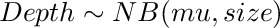
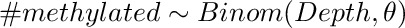
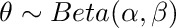
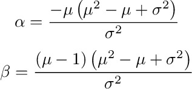

<!-- MarkdownTOC -->

- [Assessing the performance of the Bayesian method for differential methylation](#assessing-the-performance-of-the-bayesian-method-for-differential-methylation)
    - [Simulation method](#simulation-method)
    - [Preparing the simulated data](#preparing-the-simulated-data)
    - [Bayesian estimates of methylation difference](#bayesian-estimates-of-methylation-difference)
    - [Methylation difference via Fisher exact test](#methylation-difference-via-fisher-exact-test)
    - [Assessing method performance](#assessing-method-performance)

<!-- /MarkdownTOC -->

Assessing the performance of the Bayesian method for differential methylation
=============================================================================

Simulation method
-----------------

We simulate data to reproduce an experiment comparing methylation from two
samples (e.g. tumor and margin). A given number of loci are simulated and
assigned to three categories: Nearly unmethylated in both margin and tumor
(*low*), equally methylated in both margin and tumor (*ns*), differentially methylated (*sign*).

Read depth is simulated from a negative binomial distribution in order to introduce 
some overdispersion



Here, the mean is taken from the mean depth of a real dataset and the
overdispersion parameter *size* is similarly chosen to resemble the dispersion
observed in the real data.

The counts methylated at each locus are drawn from a binomial 
distribution with size given by the read depth and probability θ of being methylated
drawn from a Beta distribution:



The parameters of the Beta distribution determine the percentage methylation in tumor and margin 
for each of the three categories of loci:



The desired mean (μ) and standard deviations (σ) of the percentage methylation are converted to
 α and β parameters according to the following equations:



Preparing the simulated data
----------------------------

The R code here prepares a simulated dataset according to the method above

```
R
source('scripts/utils.R')

DEPTH<- 80      ## Expected depth at each locus
NLOC<- 1000000  ## Number of loci to simulate

bdg<- data.table(
    start= 1:NLOC,
    loc_state= c(rep('low', NLOC * 0.2), ## Prop. of loci in each category
                 rep('ns', NLOC * 0.5), 
                 rep('sign', NLOC * 0.3)),
    cnt_tot_mar= rnbinom(n= NLOC, mu= DEPTH, size= 4), ## Read depths
    cnt_tot_tum= rnbinom(n= NLOC, mu= DEPTH, size= 4))

## Prepare methylated counts: Margin
bdg[, true_pct_mar := c(
    rbeta(n= nrow(bdg[loc_state == 'low']), shape1= getBetaParams(mu= 0.1, sigma= 0.1)$a, shape2= getBetaParams(0.1, 0.1)$b),
    rbeta(n= nrow(bdg[loc_state == 'ns']), shape1= getBetaParams(0.6, 0.1)$a, shape2= getBetaParams(0.6, 0.1)$b),
    rbeta(n= nrow(bdg[loc_state == 'sign']), shape1= getBetaParams(0.6, 0.1)$a, shape2= getBetaParams(0.6, 0.1)$b))]

bdg[, cnt_met_mar := c(
    
    rbinom(n= nrow(bdg[loc_state == 'low']), size= bdg[loc_state == 'low', cnt_tot_mar], 
        prob= bdg[loc_state == 'low', true_pct_mar]),
    
    rbinom(n= nrow(bdg[loc_state == 'ns']), size= bdg[loc_state == 'ns', cnt_tot_mar], 
        prob= bdg[loc_state == 'ns', true_pct_mar]),
    
    rbinom(n= nrow(bdg[loc_state == 'sign']), size= bdg[loc_state == 'sign', cnt_tot_mar], 
        prob= bdg[loc_state == 'sign', true_pct_mar]))]

## Prepare methylated counts: Tumor
bdg[, true_pct_tum := c(
    rbeta(n= nrow(bdg[loc_state == 'low']), shape1= getBetaParams(mu= 0.1, sigma= 0.1)$a, shape2= getBetaParams(0.1, 0.1)$b),
    rbeta(n= nrow(bdg[loc_state == 'ns']), shape1= getBetaParams(0.6, 0.1)$a, shape2= getBetaParams(0.6, 0.1)$b),
    rbeta(n= nrow(bdg[loc_state == 'sign']), shape1= getBetaParams(0.8, 0.1)$a, shape2= getBetaParams(0.8, 0.1)$b))]

bdg[, cnt_met_tum := c(
    
    rbinom(n= nrow(bdg[loc_state == 'low']), size= bdg[loc_state == 'low', cnt_tot_tum], 
        prob= bdg[loc_state == 'low', true_pct_tum]),
    
    rbinom(n= nrow(bdg[loc_state == 'ns']), size= bdg[loc_state == 'ns', cnt_tot_tum], 
        prob= bdg[loc_state == 'ns', true_pct_tum]),
    
    rbinom(n= nrow(bdg[loc_state == 'sign']), size= bdg[loc_state == 'sign', cnt_tot_tum], 
        prob= bdg[loc_state == 'sign', true_pct_tum]))]

bdg[, obs_met_mar := cnt_met_mar/cnt_tot_mar]
bdg[, obs_met_tum := cnt_met_tum/cnt_tot_tum]
bdg[, obs_diff := obs_met_tum - obs_met_mar]

boxplot(data= bdg, obs_diff ~ loc_state)

gg<- ggplot(data= bdg) +
    geom_histogram(aes(x= obs_met_mar), fill= 'blue', alpha= 0.4) +
    geom_histogram(aes(x= obs_met_tum), fill= 'red', alpha= 0.4) +
    xlab('% methylation') +
    ggtitle('Observed % methylation in tumor (red) and margin (blue)')
ggsave('figures/observed_methylation.png', width= 14, height= 10, units= 'cm')
```

Now table `bdg` has the counts that would be observed from a realistic experiment.

|  |
|---------------------------------------------------------|
|**Figure 1** Distribution of simulated percentage of methylation in tumor (red) and margin (blue) |

Bayesian estimates of methylation difference
--------------------------------------------

Run Bayesian analysis. The prior parameters are estimated from the full dataset
but the posterior distribution is computed for only a subset of loci (for speed).

```
source('scripts/20160727_bayes_sim.R') # Requires the data.table bdg to 
                                       # appropriately be named. Return data.table 
                                       # postDT with posterior statistics

bdg<- bdg[start %in% postDT$start] # Subset bdg to get the loci for which the posterior 
                                   # was computed.
bdg[, mode_post_D := postDT$mode_post_D]   ## Mode of the posterior difference

# Extract pvalue-like statistic from quantiles 
pcols<- grep('p[0-9.]+_post_D', names(postDT), value= TRUE)
p<- as.numeric(sub('p', '', sub('_post_D', '', pcols)))
bayes_p<- rep(NA, nrow(postDT))
for(i in 1:nrow(postDT)){
    bayes_p[i]<- getQAtZero(as.numeric(postDT[i, pcols, with= FALSE]), p)
}
bdg[, bayes_p := ifelse(bayes_p > 0.5, 1-bayes_p, bayes_p)]
```

Methylation difference via Fisher exact test
--------------------------------------------

Now for comparison the Fisher exact test is applied to each locus to detect
difference in methylation counts between tumor and margin.

```
fisher_p<- rep(NA, nrow(bdg))
for(i in 1:nrow(bdg)){
    fisher_p[i]<- getFisherPval(as.list((bdg[i,])))
}
bdg[, fisher_p := fisher_p]
```

Assessing method performance 
----------------------------

Finally, we assess the performance of the Bayesian method and Fisher test by means
of ROC curves:

```
roc<- data.table(p= seq(0, 1, by= 0.001))
for(i in 1:nrow(roc)){
    ## At each p-value cutoff get the proportion of loci with p value < cutoff.
    ## We know what loci are different and which are equally methylated.
    roc$fnr_f[i]<- nrow(bdg[loc_state %in% c('low', 'ns') & fisher_p <= roc$p[i], ]) / nrow(bdg[loc_state %in% c('low', 'ns')])
    roc$tpr_f[i]<- nrow(bdg[loc_state == 'sign' & fisher_p <= roc$p[i], ]) / nrow(bdg[loc_state %in% 'sign'])

    roc$fnr_b[i]<- nrow(bdg[loc_state %in% c('low', 'ns') & bayes_p <= roc$p[i], ]) / nrow(bdg[loc_state %in% c('low', 'ns')])
    roc$tpr_b[i]<- nrow(bdg[loc_state == 'sign' & bayes_p <= roc$p[i], ]) / nrow(bdg[loc_state %in% 'sign'])
}

gg<- ggplot(data= roc) +
    geom_line(aes(x= fnr_f, y= tpr_f), color= 'blue') + 
    geom_line(aes(x= fnr_b, y= tpr_b), color= 'red') +
    scale_x_continuous(breaks=pretty_breaks(n=10)) + 
    scale_y_continuous(breaks=pretty_breaks(n=10)) + 
    xlab('1 - Specificity') + 
    ylab('Sensitivity') +
    ggtitle('ROC: Fisher test (blue) vs Bayesian method (red)')
ggsave('figures/roc_curve.png', width= 12, height= 10, units= 'cm')
```

|  |
|---------------------------------------------|
| **Figure 2** ROC curves for the performance of the Fisher test (blue) and Bayesian estimate (red) on the simulated dataset |
