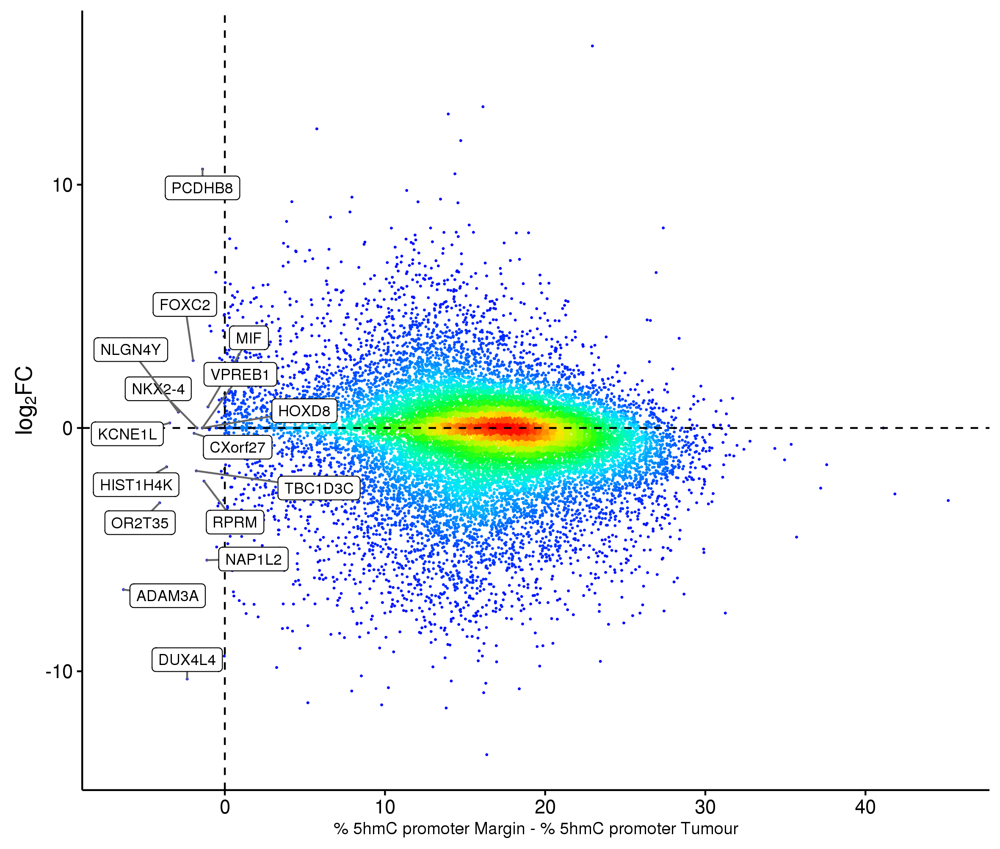
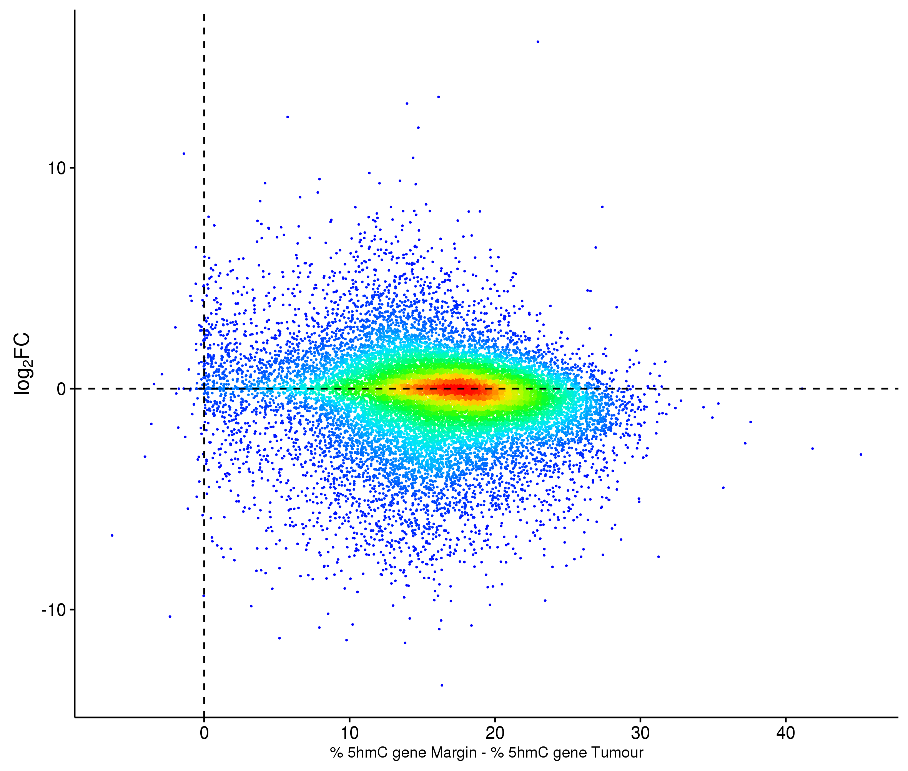

This script is an analysis to respond to Shankar:

In this dataset, whilst we saw global hmC loss (also reflected across all region of gene structure) in the tumour.  Were there any genes for which hmC levels actually went up in the tumour relative to margin? I ask because, the literature suggests that in transitional cases (e.g. development) that tissue-specific (and gene-upregulation specific) hmC levels change and can become higher in gene bodies.  For cancers, the dogma is global hmC loss, but if the transcriptional hypothesis (i.e. hmC in gene bodies marks transcriptionally active genes) is correct, there should be some cases of hmC elevation in gene bodies in the tumour. As a guide, it might be worth considering cancer genes unregulated in the tumour, to narrow the list of genes to look at.

Our analysis in the paper was restricted to promoters.  The literature appears to be stronger for gene body hmC levels vs transcription.

It is all based on our previous work:

- https://github.com/sblab-bioinformatics/epigenetics-of-glioblastoma/blob/master/20150501_methylation_brain/20160226_tsg_ocg.md
- https://github.com/sblab-bioinformatics/epigenetics-of-glioblastoma/blob/master/20150501_methylation_brain/20160531_figure_editing.md#analysis-of-expression-of-top-10-5hmc-differences-between-tumour-and-margin


## Gene body definition

Gene body was defined as the entire gene from the transcription start site to the end of the transcript [here](http://journals.plos.org/plosone/article?id=10.1371/journal.pone.0018844)

```bash
cd /lustre/sblab/martin03/repository/20150921_BrainMethylomeRoadMap
mkdir genebody_5hmC
cd genebody_5hmC
```

https://www.biostars.org/p/103411/

```r
library(GenomicFeatures)
txdb <- makeTxDbFromGFF("/lustre/sblab/martin03/reference_data/genomes/iGenomes/Homo_sapiens/UCSC/hg19/Annotation/Genes/genes.gtf", format="gtf")
genes <- genes(txdb)
write.table(as.data.frame(genes)[,-4], file = "/lustre/sblab/martin03/repository/20150921_BrainMethylomeRoadMap/genebody_5hmC/20170425_hg19_genecoords.bed", row.names = F, col.names = F, sep = "\t", quote = F)

```

After searching TET in IGV, the gene boundaries look ok.

Sort:

```bash
cd /lustre/sblab/martin03/repository/20150921_BrainMethylomeRoadMap/genebody_5hmC
sort -k1,1 -k2,2n 20170425_hg19_genecoords.bed > 20170425_hg19_genecoords_sorted.bed
wc -l 20170425_hg19_genecoords_sorted.bed # 22833
rm 20170425_hg19_genecoords.bed
```


## Intersect gene bodies and 5mC/5hmC levels

```bash
cd /lustre/sblab/martin03/repository/20150921_BrainMethylomeRoadMap/genebody_5hmC

bedtools intersect -a ../methylation_cpg/20160210/ear042_M8BS.cpg.bedGraph -b 20170425_hg19_genecoords_sorted.bed -wa -wb -sorted | cut -f 1-6,10-11 > 20170425_ear042_M8BS.cpg_hg19_genecoords_sorted.bed
bedtools intersect -a ../methylation_cpg/20160210/ear043_M8oxBS.cpg.bedGraph -b 20170425_hg19_genecoords_sorted.bed -wa -wb -sorted | cut -f 1-6,10-11 > 20170425_ear043_M8oxBS.cpg_hg19_genecoords_sorted.bed
bedtools intersect -a ../methylation_cpg/20160210/ear044_T3BS.cpg.bedGraph -b 20170425_hg19_genecoords_sorted.bed -wa -wb -sorted | cut -f 1-6,10-11 > 20170425_ear044_T3BS.cpg_hg19_genecoords_sorted.bed
bedtools intersect -a ../methylation_cpg/20160210/ear045_T3oxBS.cpg.bedGraph -b 20170425_hg19_genecoords_sorted.bed -wa -wb -sorted | cut -f 1-6,10-11 > 20170425_ear045_T3oxBS.cpg_hg19_genecoords_sorted.bed

wc -l 20170425_ear*.bed
#  28082863 20170425_ear042_M8BS.cpg_hg19_genecoords_sorted.bed
#  28039066 20170425_ear043_M8oxBS.cpg_hg19_genecoords_sorted.bed
#  28061617 20170425_ear044_T3BS.cpg_hg19_genecoords_sorted.bed
#  28052114 20170425_ear045_T3oxBS.cpg_hg19_genecoords_sorted.bed

wc -l ../methylation_cpg/20160210/ear*.cpg.bedGraph
#  54834640 ../methylation_cpg/20160210/ear042_M8BS.cpg.bedGraph
#  54765875 ../methylation_cpg/20160210/ear043_M8oxBS.cpg.bedGraph
#  54801746 ../methylation_cpg/20160210/ear044_T3BS.cpg.bedGraph
#  54788215 ../methylation_cpg/20160210/ear045_T3oxBS.cpg.bedGraph

cut -f 8 20170425_ear042_M8BS.cpg_hg19_genecoords_sorted.bed | sort | uniq | wc -l # 22338 genes in total
cut -f 8 20170425_ear043_M8oxBS.cpg_hg19_genecoords_sorted.bed | sort | uniq | wc -l # 22345 genes in total
cut -f 8 20170425_ear044_T3BS.cpg_hg19_genecoords_sorted.bed | sort | uniq | wc -l # 22346 genes in total
cut -f 8 20170425_ear045_T3oxBS.cpg_hg19_genecoords_sorted.bed | sort | uniq | wc -l # 22345 genes in total

```

The columns of the files generated above are:

- 1 chr
- 2 start
- 3 end
- 4 cnt_met
- 5 cnt_tot
- 6 + or - (C or G)
- 7 + or - (gene strandness)
- 8 gene name


## Transcript levels vs. 5mC/5hmC levels in gene bodies

https://github.com/sblab-bioinformatics/epigenetics-of-glioblastoma/blob/master/20150501_methylation_brain/20160531_figure_editing.md#analysis-of-expression-of-top-10-5hmc-differences-between-tumour-and-margin

```r
library(data.table)
library(ggplot2)
library(ggrepel)


## Adjust width
options(width=250)


## Gene body 5(h)mC
genes <- fread('tableCat.py -r "\\..*" -i /lustre/sblab/martin03/repository/20150921_BrainMethylomeRoadMap/genebody_5hmC/20170425_ear*_hg19_genecoords_sorted.bed') # 112235660
setnames(genes, names(genes), c('chrom', 'start', 'end', 'cnt_met', 'cnt_tot', 'strand', 'gene_strand', 'gene_name', 'library_id'))
genes <- genes[cnt_tot > 0,] # 112181414
genes <- genes[, list(cnt_met = sum(cnt_met), cnt_tot = sum(cnt_tot), .N), by = list(gene_name, library_id)] # 89374


## ------[ Gene bodies to include in further analysis ] -----
## Number of cytosines per gene
ggplot(data = genes[N < 1000], aes(x = N)) + geom_histogram() + facet_wrap(~library_id)
## Gene depth
ggplot(data = genes[cnt_tot < 100000], aes(x = cnt_tot)) + geom_histogram() + facet_wrap(~library_id)


# ncyt gives the number of libraries with more than x cytosines in the promoter.
# ndepth is the num of libs with cnt_tot > x
geneset <- genes[, list(ncyt = sum(N > 20), ndepth = sum(cnt_tot > 100)), by = list(gene_name)]
stopifnot(nrow(geneset) == length(unique(genes$gene_name)))


## Consider only these promoters:
nlibs <- length(unique(genes$library_id))
geneLst <- geneset[ncyt == nlibs & ndepth == nlibs, gene_name]


## Prepare table of 5mC and 5hmC in tumor and margin
genes[, pct_met := 100 * (cnt_met/cnt_tot)]
genemet <- dcast.data.table(data = genes[gene_name %in% geneLst], gene_name ~ library_id, value.var= 'pct_met')
setnames(genemet, names(genemet), c('gene_name', 'ear042_M8BS', 'ear043_M8oxBS', 'ear044_T3BS', 'ear045_T3oxBS'))
genemet <- genemet[, list(gene_name, 
   mar_mc = ear043_M8oxBS, 
   mar_hmc = ear042_M8BS - ear043_M8oxBS, 
   tum_mc = ear045_T3oxBS, 
   tum_hmc = ear044_T3BS - ear045_T3oxBS)]

genemet[, mar_hmc := ifelse(mar_hmc < 0, 0, mar_hmc)]
genemet[, tum_hmc := ifelse(tum_hmc < 0, 0, tum_hmc)]


## Table Gene Expression
tx <- fread('/lustre/sblab/martin03/repository/20150921_BrainMethylomeRoadMap/rnaseq/data/tx_quant_lfc.bed')

gxPlus<- tx[Strand == '+', list(
    chrom= min(chrom),
    promStart= min(promStart),
    Strand= min(Strand),
    ear047_F3= sum(ear047_F3),
    ear049_M3= sum(ear049_M3)), by= list(Associated_Gene_Name)]

gxMinus <- tx[Strand == '-', list(
    chrom= min(chrom),
    promStart= max(promStart),
    Strand= min(Strand),
    ear047_F3= sum(ear047_F3),
    ear049_M3= sum(ear049_M3)), by= list(Associated_Gene_Name)]

gx <- rbindlist(list(gxPlus, gxMinus))

gx[, promEnd := promStart + 1000]
gx[, tpmLog2FC := log2((ear047_F3 + 0.01) / (ear049_M3 + 0.01))]
gx$tpmLog2Avg <- rowMeans(gx[, list(log2(ear047_F3 + 0.01), log2(ear049_M3 + 0.01))])
gx <- gx[, list(chrom, promStart, promEnd, Associated_Gene_Name, Strand, ear047_F3, ear049_M3, tpmLog2FC, tpmLog2Avg)][order(chrom, promStart, promEnd)]


## Few gene names appear on forward and reverse strand! Get rid of them:
dups <- gx[duplicated(gx[, Associated_Gene_Name]), Associated_Gene_Name] ## "KBTBD4" "NPIPA7" "ZNF668" "LIMS3" "RBL1" "CKS1B"
gx <- gx[!Associated_Gene_Name %in% dups]


## 5(h)mC vs Expr
metexpr <- merge(genemet, gx, by.x= 'gene_name', by.y= 'Associated_Gene_Name')
stopifnot(nrow(metexpr) == length(unique(metexpr$gene_name)))
metexpr[, diff_hmc := mar_hmc - tum_hmc]

gg <- ggplot(data = metexpr, aes(x = diff_hmc, y = tpmLog2FC)) +
geom_point(size = 0.1, color = densCols(metexpr$diff_hmc, metexpr$tpmLog2FC, colramp = colorRampPalette(rev(rainbow(10, end = 4/6))))) +
geom_hline(yintercept = 0, col= 'black', linetype= 'dashed') +
geom_vline(xintercept = 0, col= 'black', linetype= 'dashed') +
theme_classic() +
xlab("% 5hmC promoter Margin - % 5hmC promoter Tumour") +
ylab(expression("log"[2]*"FC")) +
theme(axis.text.x = element_text(size=11), axis.text.y = element_text(size=11), axis.title.x = element_text(size=9.5), axis.title.y = element_text(size=13)) +
geom_label_repel(data = metexpr[diff_hmc < -1], aes(label = gene_name), size=3, force = 1)

ggsave('/lustre/sblab/martin03/repository/20150921_BrainMethylomeRoadMap/figure_editing/figures/20170426_genebodies_5hmC_difference_log2FC_genenames_ggrepel.png', width= 20, height= 17, units= 'cm')
system("rsync -arvuP --remove-source-files /lustre/sblab/martin03/repository/20150921_BrainMethylomeRoadMap/figure_editing/figures/20170426_genebodies_5hmC_difference_log2FC_genenames_ggrepel.png martin03@sblab-srv001:/nas/sblab_data1/group_folders/martin03/github/sblab-bioinformatics/epigenetics-of-glioblastoma/20170425_genebody_5hmC/figures")

gg <- ggplot(data = metexpr, aes(x = diff_hmc, y = tpmLog2FC)) +
geom_point(size = 0.1, color = densCols(metexpr$diff_hmc, metexpr$tpmLog2FC, colramp = colorRampPalette(rev(rainbow(10, end = 4/6))))) +
geom_hline(yintercept = 0, col= 'black', linetype= 'dashed') +
geom_vline(xintercept = 0, col= 'black', linetype= 'dashed') +
theme_classic() +
xlab("% 5hmC promoter Margin - % 5hmC promoter Tumour") +
ylab(expression("log"[2]*"FC")) +
theme(axis.text.x = element_text(size=11), axis.text.y = element_text(size=11), axis.title.x = element_text(size=9.5), axis.title.y = element_text(size=13)) +

ggsave('/lustre/sblab/martin03/repository/20150921_BrainMethylomeRoadMap/figure_editing/figures/20170426_genebodies_5hmC_difference_log2FC_genenames_ggrepel_nonames.png', width= 20, height= 17, units= 'cm')
system("rsync -arvuP --remove-source-files /lustre/sblab/martin03/repository/20150921_BrainMethylomeRoadMap/figure_editing/figures/20170426_genebodies_5hmC_difference_log2FC_genenames_ggrepel_nonames.png martin03@sblab-srv001:/nas/sblab_data1/group_folders/martin03/github/sblab-bioinformatics/epigenetics-of-glioblastoma/20170425_genebody_5hmC/figures")

```

With names:



Without names:




