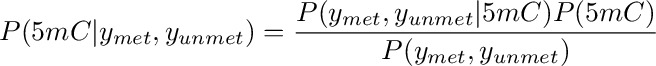
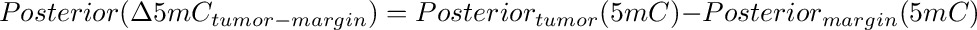
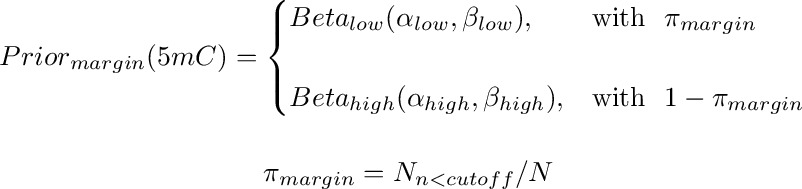
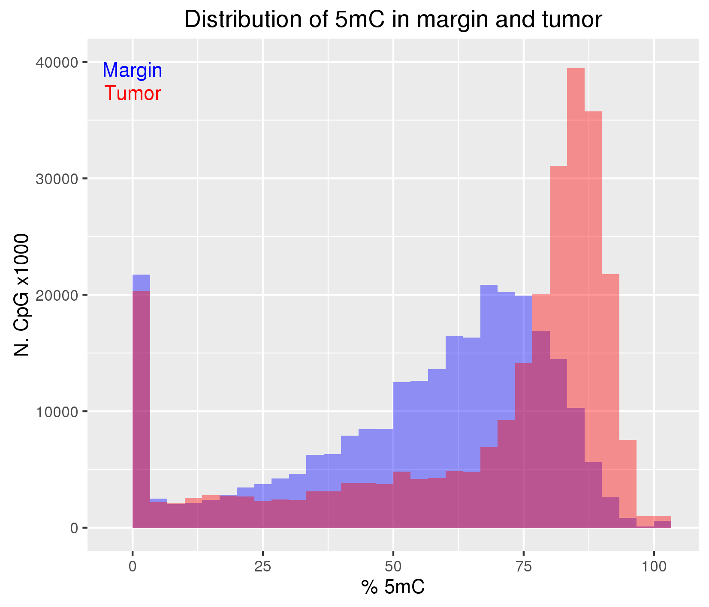
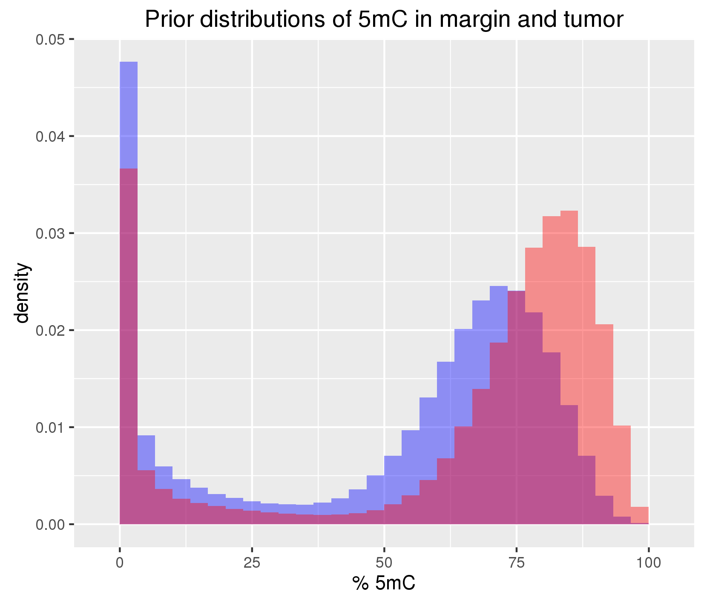
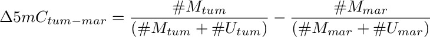
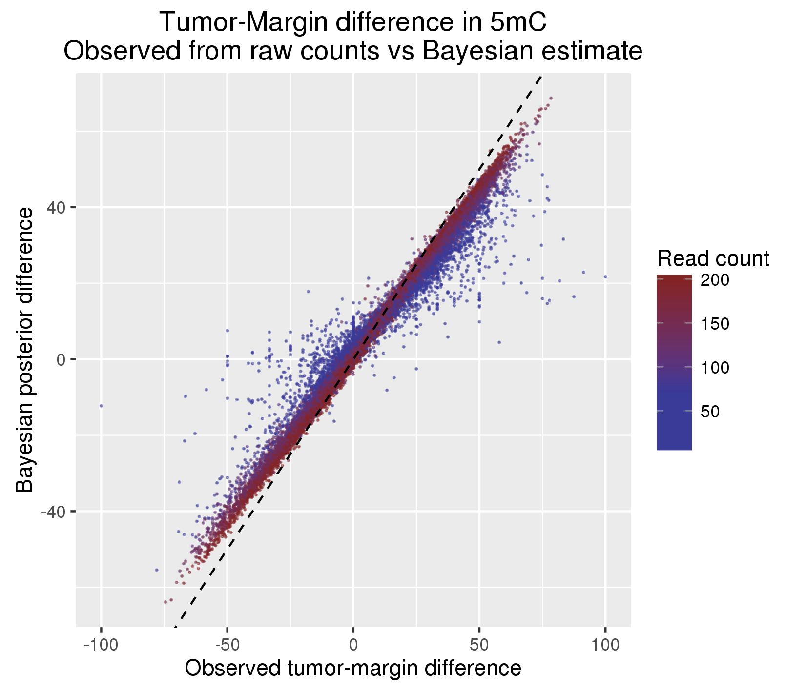
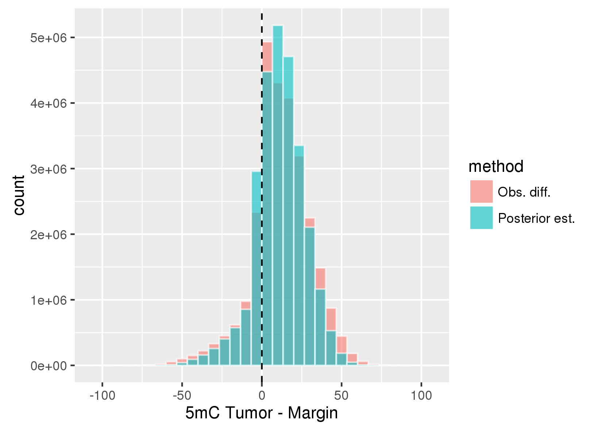
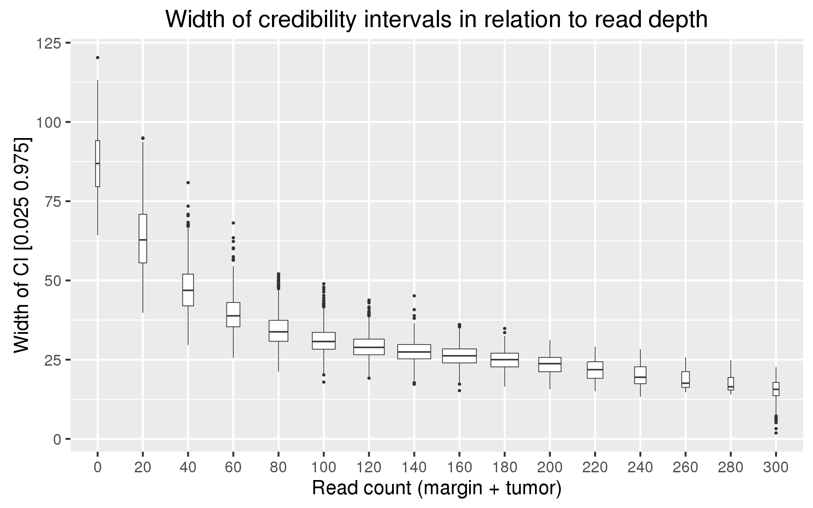

<!-- MarkdownTOC -->

- [A Bayesian estimate of the tumor-margin difference in 5mC at CpG sites](#a-bayesian-estimate-of-the-tumor-margin-difference-in-5mc-at-cpg-sites)
    - [Principle of the method](#principle-of-the-method)
    - [Preparing input data](#preparing-input-data)
    - [Prior distributions](#prior-distributions)
    - [Posterior distributions of margin and tumor 5mC and their difference](#posterior-distributions-of-margin-and-tumor-5mc-and-their-difference)
    - [Inspecting the posterior distributions](#inspecting-the-posterior-distributions)

<!-- /MarkdownTOC -->

A Bayesian estimate of the tumor-margin difference in 5mC at CpG sites
======================================================================

<!-- 
Working dir and input files

Methylation files taken from Sergio. see `20150501_methylation_brain/20160209_regenerating_methylation_files.md`

cd /nas/sblab_data1/group_folders/berald01/projects/20150501_methylation_brain/20160613_bayes/
scp uk-cri-lcst01:/lustre/sblab/martin03/repository/20150921_BrainMethylomeRoadMap/methylation_cpg/ear04*BS.cpg.bedGraph.gz ./

-->

Principle of the method
-----------------------

The difference in methylation between tumor and margin can be estimated independently for each 
cytosine (or each CpG or any other testable unit) by means, for example, of a Fisher test. This strategy, however,
ignores the information from the genome-wide distribution of methylation in tumor and margin, thus resulting in
a loss of power and in large differences especially where the read counts are small and affected by large
sampling variance. 

Here we propose a Bayesian approach to the estimate of methylation and difference in methylation that makes use 
of the genome wide distribution of methylation as prior distribution. At each CpG, this prior distribution is updated by the observed 
counts at the tested CpG to produce a posterior distribution. The mode of the posterior distribution is thus the estimated level 
of methylation. Finally, the differences between tumor and margin posteriors yield the posterior distributions of methylation 
differences. The posterior distribution thus obtained can be directly used to 
estimate *credibility intervals*, that is the interval which contains the true methylation (or difference in methylation) with a given 
probability.

The genome wide distribution of 5mC at CpG sites is markedly bimodal in both tumor or margin (see below). Therefore, the prior 
distribution reflecting this bimodality was approximated by a mixture of two beta distributions, one beta distribution for the lower mode 
and one for the upper mode. These two distributions are mixed according to the number of CpG whose methylation falls above or below a given cut-off.
Since the beta distribution is defined between 0 and 1 and can take different shapes depending on the two parameters α and β, it seems a natural choice to model the distribution of 5mC. The prior for the *margin* is represented here below (the prior for the tumor is analogous):




Where α<sub>low</sub>, β<sub>low</sub> and α<sub>high</sub>, β<sub>high</sub> are the beta parameters of the two distributions. π 
is the proportion of CpG below the chosen cut-off.

The posterior distribution of 5mC at each CpG is a beta distribution obtained by updating the prior with the observed read counts:



*y<sub>met</sub>* and *y<sub>unmet</sub>* are the observed counts methylated and un-methylated at the tested CpG. 
The posterior distribution can be used directly to obtain the most likely value of methylation (*e.g.* by extracting 
the mean, median or mode) and to produce credibility intervals. The difference in methylation between tumor and
margin is obtained by subtracting one posterior from the other. Again, the resulting distribution can be used to 
extract statistics of interest like mode and quantiles of the differential methylation:



As shown below, priors, posteriors and differences are computed by simulation.

Preparing input data
--------------------

In order to increase the statistical power and reduce the computational burden, 
the counts of methylated and total reads at C and G at each CpG site were summed so that each CpG site will 
be treated as a single testable unit. 
Only CpG with at least one read on both C and G are retained:

```bash
cut -f1-3 hg19.allCpG.bed \
| intersectBed -a - -b $bdg -wa -wb -sorted \
| groupBy -i - -g 1,2,3 -c 8,9,1 -o sum,sum,count \
| awk -v OFS="\t" '{if($6 > 1) print $1, $2, $3, $4, $5}' | gzip > $out
```

File `hg19.allCpG.bed` is a bed file of CpG positions in the hg19 genome. This file can be produced with the script [fastaRegexFinder.py](https://github.com/dariober/bioinformatics-cafe/blob/master/fastaRegexFinder.py)
as follows:

```bash
fastaRegexFinder.py -f  genome.fa -r CG --noreverse > hg19.allCpG.bed
```

`$bdg` is the bed file output of `bam2methylation.py`. 
It must contain in the 5th and 6th column the methylated and total read counts, respectively.


Since the interest here is in estimating the difference only in methylation, 
only the oxBS data is considered. First read the two relevant data files produced above in R:

```R
R
library(ggplot2)
library(data.table)
library(gridExtra)
library(parallel)
library(fitdistrplus)

## Data preparation
tum<- fread('zcat ear045_T3oxBS.cpg.bedGraph.gz') ## Methylation at CpG in tumor
mar<- fread('zcat ear043_M8oxBS.cpg.bedGraph.gz') ## Methylation at CpG in margin
stopifnot(all(mar$V3 - mar$V2 == 2))
stopifnot(all(tum$V3 - tum$V2 == 2))

mar[, V3 := NULL]
tum[, V3 := NULL]

xn<- c('chrom', 'start', 'cnt_met', 'cnt_tot')
setnames(mar, names(mar), xn)
setnames(tum, names(tum), xn)
bdg<- merge(mar, tum, by= c('chrom', 'start'), suffixes= c('_mar', '_tum'))
rm(mar, tum)

## Example data that will be used from now on
print(bdg)
          chrom    start cnt_met_mar cnt_tot_mar cnt_met_tum cnt_tot_tum
       1:  chr1    10468          33         101          71         141
       2:  chr1    10470          31          98          86         134
       3:  chr1    10483          51          84         115         141
       4:  chr1    10488          48          82         115         136
       5:  chr1    10492          37          82         105         137
      ---                                                               
27115540:  chrY 59033100         102         247          97         231
27115541:  chrY 59033171          65         139          56         177
27115542:  chrY 59033235          81         117          81         141
27115543:  chrY 59033245          68         105          79         128
27115544:  chrY 59033367           7           9           4           5
```

Methylation tends to follow a bimodal distribution:

```R
set.seed(1234)
xn<- sample(1:nrow(bdg), size= nrow(bdg)/100, replace= FALSE)
gg<- ggplot(data= bdg[xn]) +
    geom_histogram(aes(x= 100 * cnt_met_mar/cnt_tot_mar), fill= 'blue', alpha= 0.4) +
    geom_histogram(aes(x= 100 * cnt_met_tum/cnt_tot_tum), fill= 'red', alpha= 0.4) +
    ylab('N. CpG x1000') +
    xlab('% 5mC') +
    annotate("text", x = c(0, 0), y = c(40000, 38000), label = c("Margin", 'Tumor'), 
        colour= c('blue', 'red'), vjust= 1) +
    ggtitle('Distribution of 5mC in margin and tumor')
ggsave('hist_5mc_margin_tumor.png', w= 14, h= 12, units= 'cm')
```



Prior distributions
-------------------

As explained above, to capture the bimodal distribution of 5mC the prior distributions 
are empirically constructed from a mixture of two beta distributions. 
The `CUTOFF` parameter determines the boundary of the two distributions. This parameter is
chosen by visually inspecting the distribution of 5mC in tumor and margin.

`priorBetaParam_*_High` contains the α<sub>high</sub> and β<sub>high</sub> parameters of a beta distribution fitted to 
the CpGs where methylation is > CUTOFF. Conversely `priorBetaParam_*_Low` contains the beta parameters
α<sub>low</sub> and β<sub>low</sub> for the CpG methylation ≤ CUTOFF. The best estimate of the beta
parameters are obtained with the quantile matching method implemented in the R function `fitdist`:

```R
CUTOFF<- 0.5

## Margin, high and low
pct_met<- bdg[cnt_met_mar/cnt_tot_mar > CUTOFF, cnt_met_mar/cnt_tot_mar]
priorBetaParam_M_High<- fitdist(pct_met[sample(1:length(pct_met), 
    size= length(pct_met)/100)], 'beta', method= 'qme', probs= c(0.1, 0.9))

pct_met<- bdg[cnt_met_mar/cnt_tot_mar <= CUTOFF, cnt_met_mar/cnt_tot_mar]
priorBetaParam_M_Low<- fitdist(pct_met[sample(1:length(pct_met), 
    size= length(pct_met)/100)], 'beta', method= 'qme', probs= c(0.1, 0.9))

## Tumor, high and low
pct_met<- bdg[cnt_met_tum/cnt_tot_tum > CUTOFF, cnt_met_tum/cnt_tot_tum]
priorBetaParam_T_High<- fitdist(pct_met[sample(1:length(pct_met), 
    size= length(pct_met)/100)], 'beta', method= 'qme', probs= c(0.1, 0.9))

pct_met<- bdg[cnt_met_tum/cnt_tot_tum <= CUTOFF, cnt_met_tum/cnt_tot_tum]
priorBetaParam_T_Low<- fitdist(pct_met[sample(1:length(pct_met), 
    size= length(pct_met)/100)], 'beta', method= 'qme', probs= c(0.1, 0.9))
```

In order to plot and make use of the prior distributions we sample a number of data points from each pair (high and low).
The number of data points sampled from the high and low distributions is proportional to the number
of CpGs falling below and above the cutoff.

```R
prop_M_high<- nrow(bdg[cnt_met_mar/cnt_tot_mar > CUTOFF]) / nrow(bdg)
prop_T_high<- nrow(bdg[cnt_met_tum/cnt_tot_tum > CUTOFF]) / nrow(bdg)

NSIM<- 100000
rndPrior_M<- c(
    rbeta(10 * NSIM * prop_M_high, priorBetaParam_M_High$estimate[1], priorBetaParam_M_High$estimate[2]),
    rbeta(10 * NSIM * (1-prop_M_high), priorBetaParam_M_Low$estimate[1], priorBetaParam_M_Low$estimate[2]))
rndPrior_T<- c(
    rbeta(10 * NSIM * prop_T_high, priorBetaParam_T_High$estimate[1], priorBetaParam_T_High$estimate[2]),
    rbeta(10 * NSIM * (1-prop_T_high), priorBetaParam_T_Low$estimate[1], priorBetaParam_T_Low$estimate[2]))

## Plot priors:
gg<- ggplot(data= NULL) +
    geom_histogram(aes(x= 100 * rndPrior_M, y= ..density..), fill= 'blue', alpha= 0.4) +
    geom_histogram(aes(x= 100 * rndPrior_T, y= ..density..), fill= 'red', alpha= 0.4) +
    xlab('% 5mC') + 
    ggtitle('Prior distributions of 5mC in margin and tumor')
ggsave('bimodalBetaPrior_5mc_margin_tumor.png', w= 14, h= 12, units= 'cm')
```



Posterior distributions of margin and tumor 5mC and their difference
--------------------------------------------------------------------

At each CpG, the tumor and margin priors are updated using the observed data. 
From the beta posteriors for margin and tumor a number of datapoints are sampled to obtain an empyrical distribution.
The posterior distribution of the tumor - margin difference is then obtained 
by subtracting the margin posterior from the tumor posterior. Finally, some quantiles of interest and the mode
are calculated from these three posterior distributions. 

```R
Mode<- function(x) {
  ## Helper function to get mode of vector x. I.e. find the max of the 
  ## kernel density of x
  ## Default bandwidth is not the best, but it's fast
  z<- density(x)    
  return( z$x[z$y==max(z$y)] )
}


simPostDiff<- function(x, priorBetaParam_T_High, priorBetaParam_T_Low, 
                          priorBetaParam_M_High, priorBetaParam_M_Low,
                          prop_T_high, prop_M_high, nsim= 20000){
    ## Update priors given data in x
    ## x: 
    ##      Vectors of length 4 giving the observed data: 
    ##      1) count methylated in margin 2) count total in margin
    ##      3) count methylated tumor 4) count total tumor
    ## priorBetaParam_T/M_High/Low:
    ##      Parameters of the beta distribution of the low and high mC tails, 
    ##      for tumor and margin
    ## prop_T/M_high: 
    ##      Proportion of the entire mC distribution belonging to the 'high' tail
    ## nsim:
    ##      Number of random samples to draw for simulation
    ## Returns:
    ##      List of 3 vectors: Quantiles and mode of the posteriors of: 
    ##      1) Tumor 5mC, 2) Margin 5mC, 3) difference T-M

    ## Vector of quantile probabilities.
    p<- c(0.005, 0.025, 0.25, 0.5, 0.75, 0.975, 0.995)
    
    x<- unlist(x)
    stopifnot(length(x) == 4)
    stopifnot(all(!is.na(x)))

    yM = x[1]   # Met in Margin
    nM = x[2]   # Counts
    yT = x[3]   # Met in tumor
    nT = x[4]

    ## Some simple sanity check
    stopifnot(yT <= nT)
    stopifnot(yM <= nM)

    post_T<- c(
        rbeta(nsim * prop_T_high, yT + priorBetaParam_T_High$estimate[1], (nT - yT) + priorBetaParam_T_High$estimate[2]),
        rbeta(nsim * (1-prop_T_high), yT + priorBetaParam_T_Low$estimate[1], (nT - yT) + priorBetaParam_T_Low$estimate[2]))
    post_M<- c(
        rbeta(nsim * prop_M_high, yM + priorBetaParam_M_High$estimate[1], (nM - yM) + priorBetaParam_M_High$estimate[2]),
        rbeta(nsim * (1-prop_M_high), yM + priorBetaParam_M_Low$estimate[1], (nM - yM) + priorBetaParam_M_Low$estimate[2]))

    nn<- sprintf('p%s', p)
    
    ## Quantile and mode of tumor posterior
    Tq<- quantile(post_T, p);
    names(Tq)<- nn
    Tq<- c(Tq, mode= Mode(post_T))
    
    ## Quantile and mode of margin posterior
    Mq<- quantile(post_M, p)
    names(Mq)<- nn
    Mq<- c(Mq, mode= Mode(post_M))
    
    ## Quantiles and mode of the difference
    Dq<- quantile(post_T - post_M, p)
    names(Dq)<- nn
    Dq<- c(Dq, mode= Mode(post_T - post_M))
    
    qq<- list(post_T= Tq, post_M= Mq, post_D= Dq)
    return(qq)
}

## Apply simPostDiff to all CpGs:
datOxBS<- bdg[, list(cnt_met_mar,
                     cnt_tot_mar,
                     cnt_met_tum,
                     cnt_tot_tum)] ## Order of columns matters!
clus<- makeCluster(24)
clusterExport(clus, list('simPostDiff', 'Mode', 'priorBetaParam_T_High', 'priorBetaParam_T_Low', 'priorBetaParam_M_High', 'priorBetaParam_M_Low',
    'prop_T_high', 'prop_M_high'))
system.time({
outqq<- parRapply(clus, datOxBS, 
    function(x) simPostDiff(x, 
        priorBetaParam_T_High, priorBetaParam_T_Low, priorBetaParam_M_High, priorBetaParam_M_Low,
        prop_T_high, prop_M_high, nsim= 20000))
}) # MEMO: For NSIM=20000 elapsed time is ~53000s
stopCluster(clus)
save(outqq, file= 'outqq.tmp.Rdata')

## Convert to data.table
cnames<- names(outqq[[1]][[1]])
slots<- names(outqq[[1]])
postDT<- data.table(matrix(unlist(outqq), ncol= length(cnames) * length(slots), byrow= TRUE))
rm(outqq); gc()

xnames<-  apply(expand.grid(cnames, slots), 1, paste, collapse= '_')
setnames(postDT, names(postDT), xnames)
write.table(x= postDT, file= 'postDT.tmp.txt', row.names= FALSE, quote= FALSE)

# You might want to quit R and reload this obj to clean up the memory
postDT<- fread('postDT.tmp.txt')

# Add to posterior datatable the position and raw counts
postDT<- cbind(bdg, postDT)
rm(bdg); gc()

# Write out tables
write.table(x= 
  postDT[, list(chrom,
                start,
                cnt_met_mar,
                cnt_tot_mar,
                cnt_met_tum,
                cnt_tot_tum,
                p0.005= 100 * round(p0.005_post_D, 4),
                p0.025= 100 * round(p0.025_post_D, 4),
                p0.25=  100 * round(p0.25_post_D, 4),
                p0.5=   100 * round(p0.5_post_D, 4),
                p0.75=  100 * round(p0.75_post_D, 4),
                p0.975= 100 * round(p0.975_post_D, 4),
                p0.995= 100 * round(p0.995_post_D, 4),
                mode= 100 * round(mode_post_D, 4))],
  file= 'posterior_5mC_tum-mar.txt', row.names= FALSE, quote= FALSE, sep= '\t')

write.table(x= 
  postDT[, list(chrom,
                start,
                p0.005= 100 * round(p0.005_post_T, 4),
                p0.025= 100 * round(p0.025_post_T, 4),
                p0.25=  100 * round(p0.25_post_T, 4),
                p0.5=   100 * round(p0.5_post_T, 4),
                p0.75=  100 * round(p0.75_post_T, 4),
                p0.975= 100 * round(p0.975_post_T, 4),
                p0.995= 100 * round(p0.995_post_T, 4),
                mode= 100 * round(mode_post_T, 4))],
  file= 'posterior_5mC_tumor.txt', row.names= FALSE, quote= FALSE, sep= '\t')

write.table(x= 
  postDT[, list(chrom,
                start,
                p0.005= 100 * round(p0.005_post_M, 4),
                p0.025= 100 * round(p0.025_post_M, 4),
                p0.25=  100 * round(p0.25_post_M, 4),
                p0.5=   100 * round(p0.5_post_M, 4),
                p0.75=  100 * round(p0.75_post_M, 4),
                p0.975= 100 * round(p0.975_post_M, 4),
                p0.995= 100 * round(p0.995_post_M, 4),
                mode= 100 * round(mode_post_M, 4))],
  file= 'posterior_5mC_margin.txt', row.names= FALSE, quote= FALSE, sep= '\t')
system('gzip posterior_5mC*.txt')
```

The three output files, `posterior_5mC_margin.txt.gz`, `posterior_5mC_tumor.txt.gz` and `posterior_5mC_tum-mar.txt.gz` produced above
contain at each tested CpG the sample quantiles and mode of the posterior distribution of 5mC in margin, 5mC in tumor and the 5mC difference,
respectively. File `posterior_5mC_tum-mar.txt.gz` also contains the raw counts and this is a sample of the first rows:

| chrom | start | cnt_met_mar | cnt_tot_mar | cnt_met_tum | cnt_tot_tum | p0.005 | p0.025 | p0.25 | p0.5 | p0.75 | p0.975 | p0.995 | mode |
| ----- | ----- | ----------- | ----------- | ----------- | ----------- | ------ | ------ | ----- | ---- | ----- | ------ | ------ | ---- |
| chr1 | 10468 | 33 | 101 | 71 | 141 | 0.29 | 4.26 | 12.13 | 16.42 | 20.65 | 28.87 | 32.81 | 17.1 |
| chr1 | 10470 | 31 | 98 | 86 | 134 | 13.87 | 17.54 | 25.64 | 29.95 | 34.26 | 42.51 | 46.41 | 30.08 |
| chr1 | 10483 | 51 | 84 | 115 | 141 | 4.62 | 8.19 | 15.68 | 19.66 | 23.73 | 31.72 | 35.28 | 19.44 |
| chr1 | 10488 | 48 | 82 | 115 | 136 | 9.1 | 12.79 | 20.37 | 24.39 | 28.43 | 36.51 | 40.28 | 24.28 |
| chr1 | 10492 | 37 | 82 | 105 | 137 | 12.33 | 16.32 | 24.47 | 28.88 | 33.32 | 41.7 | 45.8 | 29.3 |
| chr1 | 10496 | 40 | 88 | 122 | 146 | 19.57 | 23.29 | 31 | 35.11 | 39.19 | 47.35 | 51.33 | 35.03 |
| chr1 | 10524 | 60 | 92 | 134 | 153 | 8.22 | 11.2 | 17.77 | 21.38 | 24.99 | 32.03 | 35.75 | 22.01 |
| chr1 | 10541 | 44 | 84 | 118 | 143 | 12.32 | 16.02 | 23.87 | 27.97 | 32.15 | 40.26 | 44.05 | 27.7 | 
| chr1 | 10562 | 38 | 63 | 99 | 125 | 0.97 | 4.66 | 13.19 | 17.67 | 22.34 | 31.23 | 35.48 | 16.47 | 

Inspecting the posterior distributions
--------------------------------------

The Bayesian estimates of the tumor-margin differences were compared to the observed differences simply calculated as:



Where #M and #U are the read count methylated and unmethylated, respectively.

As it should be expected, there is a good correlation between observed and Bayesian estimates. 
However, the Bayesian estimates tend to produce less extreme differences in particular where the read counts 
are smaller (blue dots, in the plot below) as in these cases the prior tends to be less affected by the observed 
data.

 

```R
R
library(data.table)
library(scales)
library(ggplot2)

postDiff<- fread('zcat posterior_5mC_tum-mar.txt.gz')
xn<- seq(1, nrow(postDiff), length.out= 50000)
gg<- ggplot(data= postDiff[xn, ], aes(x= 100 * ((cnt_met_tum/cnt_tot_tum) - (cnt_met_mar/cnt_tot_mar)), y= mode,
    colour= ifelse(cnt_tot_mar + cnt_tot_tum > 200, 200, cnt_tot_mar + cnt_tot_tum))) +
    scale_colour_gradient2('Read count', low=muted("blue"), high=muted("red"), midpoint= 75, mid= muted('blue')) +
    geom_point(alpha= 0.50, size= 0.15) +
    geom_abline(intercept= 0, slope= 1, linetype= 'dashed') +
    xlab('Observed tumor-margin difference') +
    ylab('Bayesian posterior difference') +
    ggtitle('Tumor-Margin difference in 5mC\nObserved from raw counts vs Bayesian estimate')
ggsave('posterior_difference_5mc_margin_tumor.png', w= 14, h= 12, units= 'cm')
```

Overall, the Bayesian estimates produce a slightly narrower histogram of methylation differences:



```R
dat<- rbindlist(list(
    postDiff[, list(diff= mode, method= 'Posterior est.')],
    postDiff[, list(diff= 100 * ((cnt_met_tum/cnt_tot_tum) - (cnt_met_mar/cnt_tot_mar)), method= 'Obs. diff.')]
))
gg<- ggplot(data= dat, aes(x= diff, fill= method)) +
    geom_histogram(alpha= 0.6, colour= 'white', position= 'identity') +
    geom_vline(xintercept= 0, linetype= 'dashed') +
    xlab('5mC Tumor - Margin')
ggsave('posterior_difference_5mc_margin_tumor_hist.png', w= 14, h= 10, units= 'cm')
```

Finally, we inspected the width of the credibility intervals in relation to read count. These intervals 
are the differences between the 2.5% and 97.5% percentile of the posterior distributions. In the boxplot below,
the width of the boxes is proportional to the number of datapoints. 


 

```R
postDiff[, depth_bin := round((cnt_tot_mar + cnt_tot_tum)/20)*20]
postDiff[, depth_bin := ifelse(depth_bin > 300, 300, depth_bin)]
postDiff[, depth_bin := factor(depth_bin, levels= sort(unique(depth_bin)))]
xn<- seq(1, nrow(postDiff), length.out= 500000)
gg<- ggplot(data= postDiff[xn,], aes(x= depth_bin, y= abs(p0.025 - p0.975))) +
    geom_boxplot(varwidth= TRUE, size= 0.2, outlier.size= 0.2) +
    xlab('Binned read count (margin + tumor)') +
    ylab('Width of CI [0.025 0.975]') +
    ggtitle('Width of credibility intervals in relation to read depth')
ggsave('credint_5mc_margin_tumor.png', w= 16, h= 10, units= 'cm')
```

