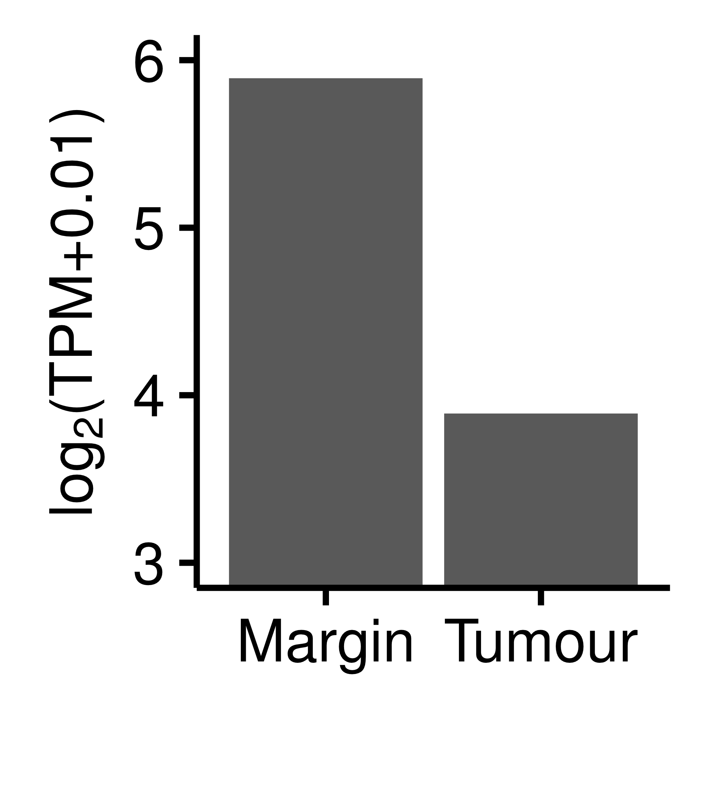

<!-- MarkdownTOC -->

- [Software tools and requirements](#software-tools-and-requirements)
- [Transcript expression from RNA-Seq](#transcript-expression-from-rna-seq)
- [Transcript levels ATRX gene](#transcript-levels-atrx-gene)
- [TODO](#todo)

<!-- /MarkdownTOC -->

Software tools and requirements
===============================

All data processing was implemented under Linux environment with standard GNU coreutils tools. 
Additional required software:

* [kallisto](https://pachterlab.github.io/kallisto/)
* [R-3.2.3](https://cran.r-project.org/) 
* Transcripts in fasta format for [hg19/grch37](ftp://ftp.ensembl.org/pub/grch37/release-83/fasta/homo_sapiens/cdna/Homo_sapiens.GRCh37.cdna.all.fa.gz)

Transcript expression from RNA-Seq
==================================

<!-- 
For this part see 
https://github.com/sblab-bioinformatics/projects/blob/master/20150501_methylation_brain/20160303_rnaseq/20160303_rnaseq.md
 -->

Transcript expressions were assessed by aligning RNA-Seq against the reference transcripts from Ensembl using `Kallisto`. 
First reference sequences were indexed:

```
kallisto index -i Homo_sapiens.GRCh37.cdna.all.idx Homo_sapiens.GRCh37.cdna.all.fa.gz
```

Transcript quantitation was obtained for each library as follows:

```
kallisto quant --bias -i Homo_sapiens.GRCh37.cdna.all.idx -o ${x}.tx <(zcat $fq1) <(zcat $fq2)
```

Where `$fq1` and `$fq2` are fastq file for the two mates of each pair and `${x}` is the base-name for the output file.


Transcript levels ATRX gene
===========================

```R
library(data.table)
library(ggplot2)

tx<- fread('tx_quant_lfc.bed')

gxPlus<- tx[Strand == '+', list(
    chrom= min(chrom),
    promStart= min(promStart),
    Strand= min(Strand),
    ear047_F3= sum(ear047_F3),
    ear049_M3= sum(ear049_M3)), by= list(Associated_Gene_Name)]

gxMinus<- tx[Strand == '-', list(
    chrom= min(chrom),
    promStart= max(promStart),
    Strand= min(Strand),
    ear047_F3= sum(ear047_F3),
    ear049_M3= sum(ear049_M3)), by= list(Associated_Gene_Name)]

gx<- rbindlist(list(gxPlus, gxMinus))
gx[, promEnd := promStart + 1000]
gx[, tpmLog2FC := log2((ear047_F3 + 0.01) / (ear049_M3 + 0.01))]
gx$tpmLog2Avg<- rowMeans(gx[, list(log2(ear047_F3 + 0.01), log2(ear049_M3 + 0.01))])
gx<- gx[, list(chrom, promStart, promEnd, Associated_Gene_Name, Strand, ear047_F3, ear049_M3, tpmLog2FC, tpmLog2Avg)][order(chrom, promStart, promEnd)]


xdata2 <- gx[Associated_Gene_Name == "ATRX"]

tab2 <- xdata2[, list(Associated_Gene_Name = Associated_Gene_Name, ear047_F3.log = log2(ear047_F3 + 0.01), ear049_M3.log = log2(ear049_M3 + 0.01))]

tab.summary2 <- reshape2::melt(tab2, id.vars = "Associated_Gene_Name", variable.name = "sample", value.name = "expression")
tab.summary2[, sample2 := factor(c("Tumour", "Margin"))]
tab.summary2[, sample := NULL]

gg <- ggplot(tab.summary2, aes(x = sample2, y = expression)) +
geom_bar(stat = "identity") +
xlab("") +
ylab(expression("log"[2]*"(TPM+0.01)")) +
theme_classic() +
theme(legend.title = element_blank(), strip.background = element_blank(), axis.text.x = element_text(size=10), axis.title.y = element_text(size=10)) +
coord_cartesian(ylim = c(3, 6)) +
scale_y_continuous(breaks = seq(0, 10, 1))
ggsave("figure/ATRX.expression.ylim3_6.png", width = 4.25/2.54, height = 4.75/2.54)
```




TODO
====

Code for all figures and tables, depending on what we put in the manuscript
